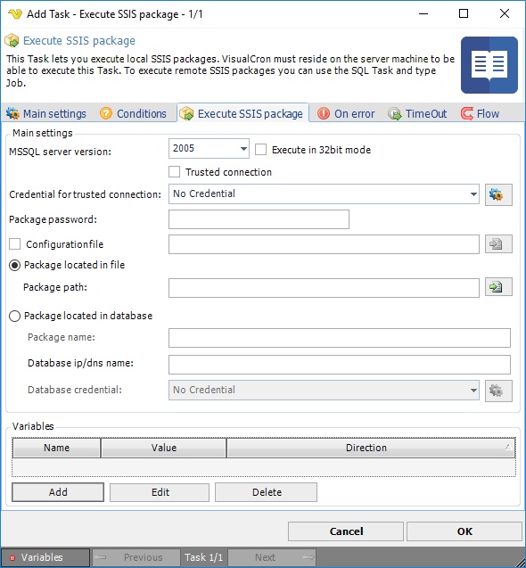

## Task Database - Execute SSIS Package

This Task lets you execute local SSIS packages. VisualCron must reside on the server machine to be able to execute this Task. To execute remote SSIS packages you can use the **SQL** Task and type Job.
 
**Execute SSIS package** tab



**MSSQL server version**

Select if you are using MSSQL 2005 or 2008.
 
**Execute in 32 bit mode**

Check this if your MSSQL version is running in 32 bit mode.
 
**Credential**

A set of Credentials that is used to impersonate the whole SSIS call. Click the Settings icon to open the Manage credentials dialog.
 
**Package located in file**

Specify the full path to the file.
 
**Package located in database**

If the package is located in the database then you specify the package name here.
 
**SQL Credential**

Specify a Credential that consists of the server name or IP address together with user name and password.
 
**Variables**

If the package needs variables you enter them here by clicking on Add.
 
:::info Note

For this Task to work you need to have installed, at least, SQL Server Integration Services, on the machine that VisualCron is installed on.
For more information, see [SQL Server Integration Services](https://en.wikipedia.org/wiki/SQL_Server_Integration_Services).

:::

### Troubleshooting

**Could not load file or assembly '```Microsoft.SqlServer.DTSRuntimeWrap```'.**

1. Install SQL Server Integration Services.
2. Make sure you set the Task to run in 32 or 64 bit depending on your SQL Server integration services install.