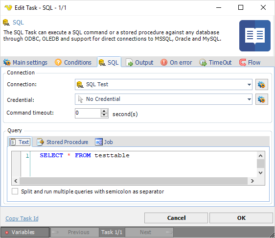
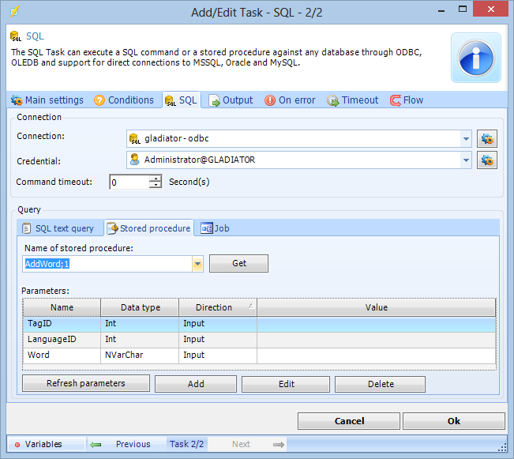
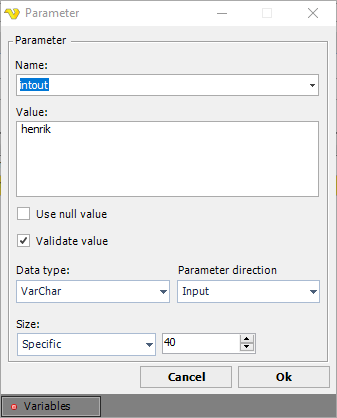
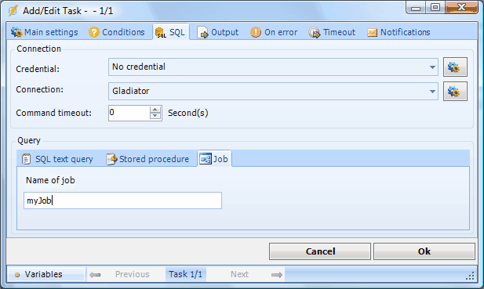
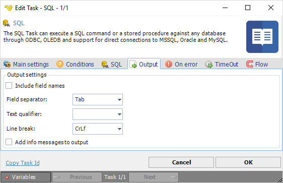
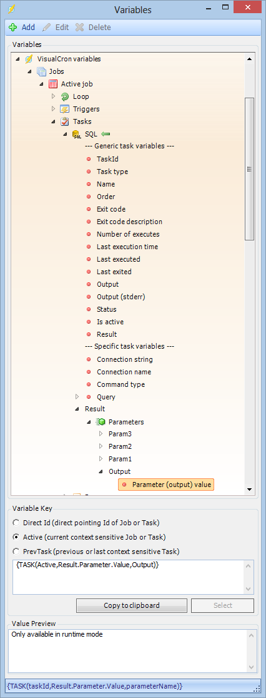

## Task Database - SQL

The SQL Task can execute a SQL command or a stored procedure against any database through ODBC, OLEDB and support for direct connections to MSSQL, Oracle and MySQL.
 
Select type of query; T*ext* or *Stored Procedur*e, only the active tab is saved.
 
**SQL** tab



**Connection**
To use the SQL Task you need to create a Connection first. You do that in the [Connections](../../../server/global-connections) dialog.
 
**Credential**

If you want to Execute with a trusted connection in MSSQL you need to use a [Credential](../../../server/global-credentials) in combination with the Connection for trusted connection. The Credential must be a valid Windows user on the local server (if database is local) or a valid user on remote server (if server is not local).
 
**Command Timeout**

Timeout in seconds before the query should exit.
 
**Text**

Enter your SQL text query.
 
**Split and run multiple queries with semicolon as separator**

Text ...
 
**SQL > Stored Procedure** sub tab



**Name of stored procedure**

The name of the stored procedure to be executed. Click the Refresh icon to populate the drop-down list of stored procedures.
 
**Parameters**

The grid shows all defined parameters. Click the Add button to open the parameter window. Click other buttons to update the list of parameters.



Enter parameter values for Name, Value, Data type and Parameter direction.
 
**Use null value**

If checked, the NULL value will override the Value.
 
**Validate value**

If checked, VisualCron will validate the value with the value type. Leave not checked if you are using a Variable as value and the Variable is not yet set.
 
Test your SQL Task before closing the VisualCron client. Errors will be reported in the log window.
 
**SQL > Job** sub tab



The Job definitions are only valid for MSSQL.
 
Use this option if you want to execute a remote Package of type SSIS/DTS. You need to create a Job of your package first.
 
**Name of Job**

Specify the Job name if you want to execute a Job in the database.
 
**Job steps**

Define a flow of steps with decision points depending on correct or failed result.
 
**Output** tab



The output tab controls the format of the date output from the SQL Task.
 
**Include field names**

If the columns should be included in the output or not.
 
**Field separator**

Here you can control what separates each field.
 
**Text qualifier**

The text qualifier is the parts surrounding a field. Normally nothing which is default.
 
**Line break**

Controls what type of line break should be used.
 
**Add info messages to output**

Internal SQL database engine debug and warning output will be added to Task output if this is checked.
 
:::info Note

* use appropriate prefix on variable, normally @variablename
* take advantage of predefined connection strings
* when using ODBC, remembe to add your parameters in the order you want to use them
* if you have DNS connections - take advantage of them
* test SQL Tasks and look for error message in the log window
* if you are running PL-SQL statement on Oracle write them like this: ```BEGIN FM.MQ.ADD_MSG_DIRECT('FORM','LV_SENDER','LV_POSN_UPLOAD',213,'ORG_ID'); END;```
* to get Output parameters please use the result Variables below:

:::



### Troubleshooting

** ```ODBC->ERROR [42000] [Microsoft][ODBC SQL Server Driver][SQL Server]Invalid parameter 1 (''):  Data type 0x23``` is a deprecated large object, or LOB, but is marked as output parameter. Deprecated types are not supported as output parameters. Use current large object types instead.**

* Try changing data type from Text to VarChar or NVarChar.
* Also, make sure you are using the exact length of the parameter compared to the object in MSSQL.
 
**The Size property has an invalid size of 0.**

Try setting the same exact size as the parameter.
 
**ORA03113**

Try upgrading to the latest version of VisualCron.