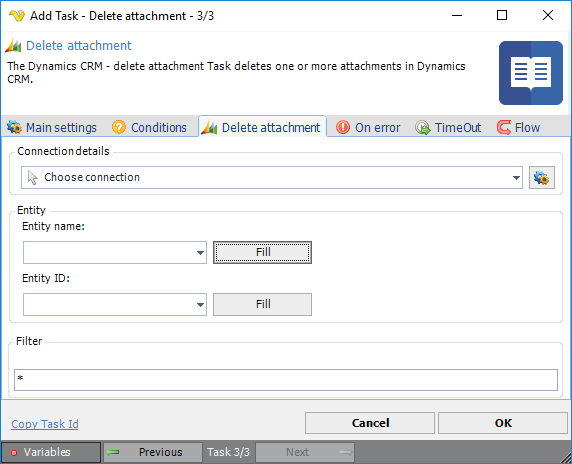

## Task Dynamics CRM - Delete Attachments

The Dynamics CRM - Delete attachment Task deletes one or more attachments from a Dynamics CRM instance.

**Connection details**

To use Dynamics CRM Tasks you need to create a [Connection](../../global-connections) first. Click the *Settings* icon to open the *Manage Connections* dialog.
 
**Entity name**

The logical name of the entity to get information from. Click the *Fill* button to list existing Entities in the Dynamics CRM instance.
 
**Entity Id**

Click the *Fill* button to list existing Entity Id's based on the selected Entity.
 
**Filter**

File filter for the attachments.