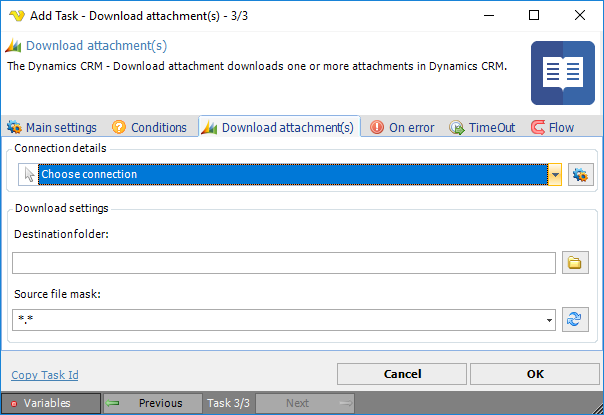

## Task Dynamics CRM - Download Attachments

The Dynamics CRM - Download attachment Task downloads one or more attachments a from Dynamics CRM instance.

**Connection**

To use Dynamics CRM Tasks you need to create a [Connection](../../global-connections) first. Click the *Settings* icon to open the *Manage Connections* dialog.
 
**Destination folder**

Local destination folder where the downloaded files should be stored. Click the *Folder* icon to browse and select a specific Dynamics CRM folder.
 
**Source file mask**

File mask for filtering out attachments in Dynamics CRM instance.