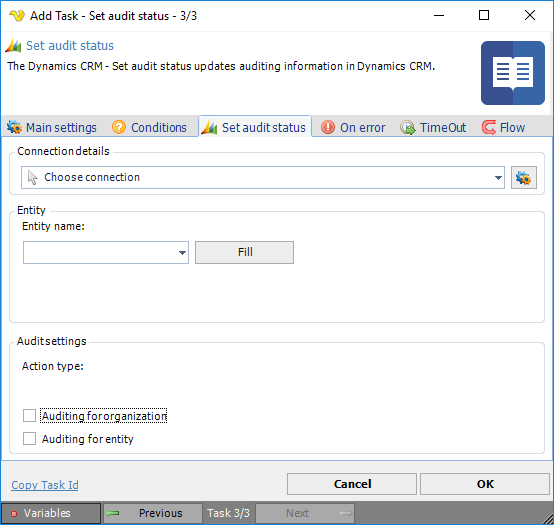

## Task Dynamics CRM - Set Audit Status

The Dynamics CRM - Set audit data Task changes auditing status on a specific Entity in a Dynamics CRM instance.
 
The audit data it will return a string containing list of changes made from the moment you have enabled audit.

**Connection**

To use Dynamics CRM Tasks you need to create a [Connection](../../global-connections) first. Click the *Settings* icon to open the *Manage Connections* dialog.
 
**Entity name**

The logical name of the entity to get information from. Click the *Fill* button to list existing Entities in the Dynamics CRM instance.
 
**Auditing for organization**

Enables/disables auditing for organization.
 
**Auditing for entity**

Enables/disables auditing for entity.
 
:::tip Note 

If auditing is not enabled at the organization level, auditing of entities and attributes, even if it is enabled, does not occur. By default, auditing is enabled on all auditable entity attributes but is disabled at the entity and organization level.

:::