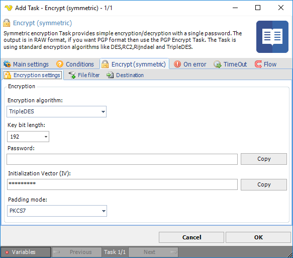
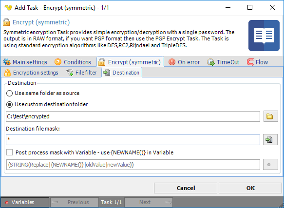

## Task Encryption - Encrypt (Symmetric)

Symmetric encryption Task provides simple encryption/decryption with a single password. The output is in RAW format, if you want PGP format then use the [PGP Encrypt Task](pgp-encrypt). The Task is using standard encryption algorithms like:
 
| Provider | Length (bits) | Known Vulnerabilities |
|:---:|:---:|:---:|
| DES | 64 | yes |
| RC2 | 40-128 | yes |
| Rijndael | 128, 192, 256 | no |
| TripleDES | 128, 192 | no |
| AES | 128, 192, 256 | no |
 
If you have a choice, we recommend using AES encryption.
 
The Encryption - Encrypt (symmetric) Task is able to encrypt one or more files to a specific folder.
 
**Encrypt > Encryption settings** tab

**Encryption algorithm**

Select between the following encryption algorithms:
* DES
* RC2
* Rijndael
* TripleDES
* AES
 
Please note that different algorithms support different *Key bit length*.
 
**Key bit length**

The key bit length defines the strength of the encryption. The higher the better. Different algorithms support different key bit length.
 
**Password**

Select a password that will be used for encryption/decryption. The password is hidden in the interface but you can press Copy to copy the the password to clip board.
 
**Encrypt > File filter** tab
In the File filter tab you define which files should be encrypted. Read more about file filter [here](../../../server/job-tasks-file-filter).
 
**Encrypt > Destination** tab

**Destination**

You can choose to encrypt files to same folder as where the original file was found by selecting *Use same folder* as source. If you select *Use custom destination folder* you are able to select a different destination folder for the encrypted file than source folder.
 
**Destination file mask**

Destination file mask is a quick way to change the file name to something else. By default it is using `*` which means that the same file name will be used for destination folder. If you are going to use `*` you need to use another destination folder. If you for example want to change the original extension to "`enc`" instead you can change this destination file mask to `*.enc`.
 
**Post process mask with Variable**

This property gives you more advanced ways to change the file name. We recommend that you use Destination file mask with value `*` when using this property. When checking this property the new name will be stored in a temporary variable `{NEWNAME()}`. You will be able to use this Variable for processing with other Variable functions. As an example we have provided the default value for this property: `{STRING(Replace|{NEWNAME()}|oldValue|newValue)}`. The example uses the String.Replace method from the Variables window. It uses the `{NEWNAME()}` as input Variable with options to set a value that you want to replace from original file name "oldValue" and the new value "newValue".