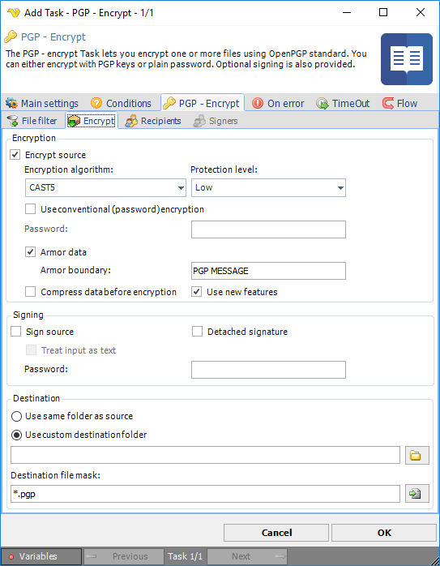
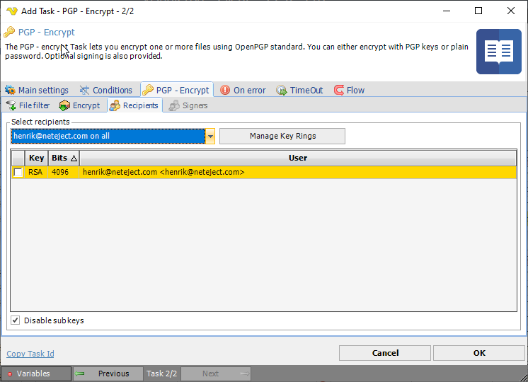
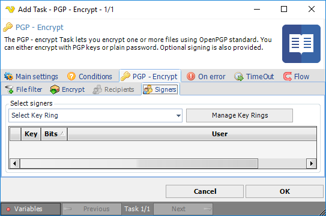

## Task Encrpytion - PGP Encryption

The PGP - encrypt Task lets you encrypt one or more files using OpenPGP standard. You can either encrypt with PGP keys or plain password. Optional signing is also provided.
 
General [PGP information](../../../server/global-pgp-key-rings) is available.
 
The PGP Task is selected in the *Add/Edit Task* window by *Encryption -> PGP*. In the *Main settings* tab a name for the Task is entered.
 
**PGP Encrypt > File filter > Location** sub tab
In the File filter tab you define which files should be encrypted. Read more about file filter [here](../../../server/job-tasks-file-filter).
 
**PGP Encrypt > Encryp**t sub tab

Here you have two major options when encrypting a file; either Encrypt, Sign or both.
 
**Encrypt source**

Mark this option to enable encryption of your file. The Recipients tab is connected to this property.
 
**Encryption algorithm**

VisualCron offers some standard algorithms. If you need any other algorithm then contact us.
 
**Protection level**

* *Low* - to get the key from password only, password hash is used
* *Normal* - hash from password and salt concatenation is used
* *High* - hash from multiple password and salt concatenation is used
 
**Use conventional (password) encryption**

A password will be used for encryption. Enter a password in the password field. You can use this for doing simple symmetric encryption without key rings.
 
**Armor data**

Use this property to determine if resulting data should be armored, i.e. wrapped into base64-cover.
 
**Compress data before encryption**

Specifies if the data should be compressed before encryption.
 
**Use new features**

Use this property for compatibility with old versions of PGP-compatible software.
 
If this property is set to True, then newer and stronger algorithms will be used in this Signinng willl be compatible with PGP 2.6.x, while Encrypt and sign will not.
 
If the property is set to False, then the result will be compatible with PGP 2.6.x, while the keys are compatible (i.e. don't use features not supported by PGP 2.6.x). Default value is True.
 
**Sign source**

Mark this option if you want to sign your file. Use the this option along with selecting private key rings in the PGP -> Signers tab.
 
**Treat input as text**

Use this property when you want to specify that input data must be interpreted as text.
 
**Password**

If you have a password on your private key, then enter it here.
 
**Destination file/Destination folder**

The destination file is the path to the file where the encrypted file should be saved or, when using Decrypt, where the decrypted file should be saved. When using wild cards this field will become *Destination folder* and all source files will be appended with ".pgp".
 
**Use default naming for destination file**
When decrypting a file you can either specify a file name in the *Destination file* or use this property. When using this property the original name (from the PGP MESSAGE) will be used when writing the file. When this property is checked you can use *Destination file* for specifying another folder than the source file folder location.
 
**PGP Encrypt > Recipients** sub tab

Specifies the key ring with public keys that belongs to the recipients of the file. Select a key ring, then mark the (public) keys that belongs to a recipient of the file.
 
**Disable sub keys**

Note: in certain scenarios, especially where heavy multi-subkey structures are used, there might be a need to specify the exact subkey to be used for encryption. While VisualCron (SBB component) does its best to find the appropriate encryption key or subkey automatically, sometimes this is not possible due to lack of information stored within the keys. If unsure about the purpose of a particular primary key or subkey (i.e. whether it is signing-only, encryption-only or both encryption and signing capable), SBB always uses it for encryption. As a result, the resulting file may be encrypted with multiple keys, which might be confusing for the receiving software. You can tell TElPGPWriter that it must not encrypt the file for a particular key or subkey by setting its Enabled property to false. [https://cdn.nsoftware.com/help/legacy/sbb/ref_howto_pgp_files_encryptkey.html](https://cdn.nsoftware.com/help/legacy/sbb/ref_howto_pgp_files_encryptkey.html)
 
**PGP Encrypt > Signers** sub tab

Specifies the key ring with keys which must be used for data signing. Select a key ring, then check the (private) keys you want to use for signing.
 
Key rings are managed in the *PGP -> Recipients* or the *PGP -> Signers* tabs by clicking on Manage Key Rings button. In the Manage PGP Key Ring window, click on the Add button to open the *Add PGP Key Ring* window. More information is available for [manage PGP key rings](../../../server/global-pgp-key-rings).
 
**Disable sub keys**

:::info Note 

In certain scenarios, especially where heavy multi-subkey structures are used, there might be a need to specify the exact subkey to be used for signing. While VisualCron (SBB component) does its best to find the appropriate signing key or subkey automatically, sometimes this is not possible due to lack of information stored within the keys. If unsure about the purpose of a particular primary key or subkey (i.e. whether it is signing-only, encryption-only or both encryption and signing capable), SBB always uses it for signing. As a result, the resulting file may be signing with multiple keys, which might be confusing for the receiving software. You can tell TElPGPWriter that it must not encrypt the file for a particular key or subkey by setting its Enabled property to false. [https://cdn.nsoftware.com/help/legacy/sbb/ref_howto_pgp_files_encryptkey.html](https://cdn.nsoftware.com/help/legacy/sbb/ref_howto_pgp_files_encryptkey.html)
 
:::

### Troubleshooting

**The encrypted file gets signed twice**

Try to check Disable sub keys under Signers tab.
 
**No suitable OpenPGP public key for encryption found**

Try to uncheck Disable sub keys under the Recipients tab.