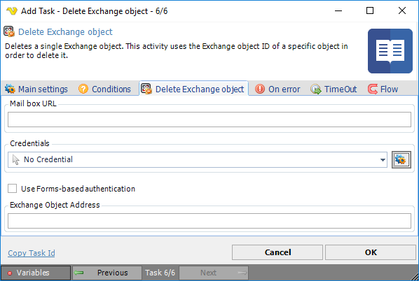

## Task Exchange - Delete Exchange Object

Deletes a single Exchange object. This activity uses the Exchange object ID of a specific object in order to delete it.

**Mailbox URL**

Should have the following format: [http://servername/exchange/recipient@company.com](http://servername/exchange/recipient@company.com)
 
**Credentials**

To control a remote computer you may need to use a [Credential](../../global-credentials). The Credential must match the user name and password of the user that you want to login for. Select a Credential in the combo box or click the *Settings* icon to open *Manage credentials* in order to add or edit Credentials.
 
**Use Forms-based authentication**

If not Windows Forms-based authentication is used, then Windows authentication is used.
 
**Exchange Object Address**

Text ...