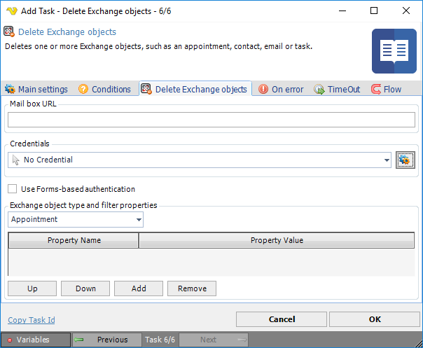

## Task Exchange - Delete Exchange Objects

Deletes one or more Exchange objects, such as appointment, contact, email or task.

**Mailbox URL**

Should have the following format: [http://servername/exchange/recipient@company.com](http://servername/exchange/recipient@company.com)
 
**Credentials**

To control a remote computer you may need to use a [Credential](../../global-credentials). The Credential must match the user name and password of the user that you want to login for. Select a Credential in the combo box or click the *Settings* icon to open *Manage credentials* in order to add or edit Credentials.
 
**Use Forms-based authentication**

If not Windows Forms-based authentication is used, then Windows authentication is used.
 
**Exchange object type and filter properties**

Select the appropriate Exchange object in the list: Appointment, Contact or Task. Press the Add button to add a property to be defined. In the list of defined objects, mark and select: Remove, Move up and Move Down.