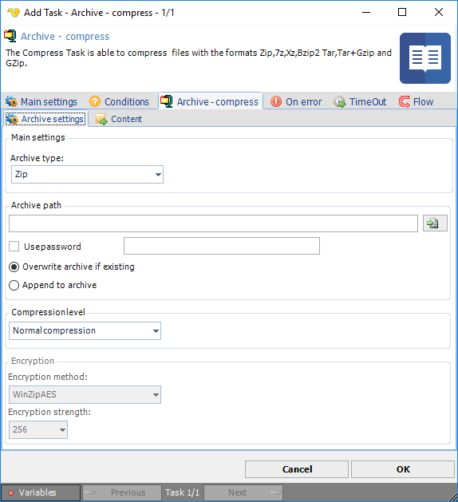

## Task File - Archive - Compress

The Compress Task is able to compress  files with the formats Zip,7z,Xz,Bzip2 Tar,Tar+Gzip and GZip.
 
The different formats provides different functionality and compatibility across different operating systems. The Tar and GZip formats can be used to read or write archives between Windows and Linux/Unix. The **Zip** format is the most versatile and the most common in Windows workstations. It allows you to encrypt your archive with a password and select a compression level.
 
VisualCron's **Tar** implementation is fully compatible (reading and creating) with the "USTAR" (Unix Standard TAR) archive format. The implementation is capable of reading, but not writing files with a "posix Tar" or "GNU Tar" format, as long as archive entries do not use the header extensions from either of these formats. If unsupported header extensions are encountered when reading a Tar archive, an exception will be thrown.
 
The USTAR format has a few limitations, two of which should be emphasized. It should be noted that these are limitations of the USTAR format and not of VisualCron's implementation.
 
First, the underlying representation (i.e., in the Tar format itself) of the name of an item in a Tar archive is represented by two fields, Name and Prefix (which corresponds roughly to the pathname). These fields are combined and exposed through the FullName property. The combined length of the file and path names cannot exceed 256 characters.
 
The second limitation is that the maximum size of file that can be archived is 8 GB. This does not mean that the maximum size of a Tar archive is 8 GB; a Tar archive can contain as many 8 GB items as is allowed by the file system of the operating system.
 
Although Tar and GZip are more commonly used on Unix or Linux platforms, incorporating Xceed's implementations of these file formats into your applications will ensure maximum compatibility with file types.
 
**Tar** and **GZip** are usually used together. Tar is an archive; it gathers a collection of files or folders into a single file, while preserving file system information (such as permissions, dates and the folder structure). However, Tar does not compress the files in any way. The GZip format on the other hand is typically used to compress single files (although it is possible for a GZip archive to contain multiple files, see Multi-file operations for details).
 
Using these two formats together, Tar to create an archive and then compressing it with GZip, can potentially attain greater compression ratios than using a compressing archiver such as ZIP. The ZIP format compresses the individual files and then archives them into a single .zip file. With a GZip Tar file, files are first archived into a .tar file and then the complete archive is compressed. The advantage is that the compression engine searches for similar patterns across the entire archive, rather than just within each individual file, thereby increasing the chances of finding the patterns for this kind of compression. Another advantage in using GZip is that it is currently not encumbered by patents. As a result, there are no additional licensing fees to worry about. When used together, the resulting files typically have a .tar.gz or .tgz extension.

:::note NTFS long paths in Windows
 
By default, the [maximum path length limit in Windows](https://learn.microsoft.com/en-us/windows/win32/fileio/maximum-file-path-limitation?tabs=registry) is 260 characters. However, it is possible to remove the limitation on Windows 10 (v. 1607 or later) so that VisualCron will support the paths that are longer than 260 characters. In the context of the current Task, this feature allows to archive files within folders of unlimited depth, ensuring correct extraction at any nesting level of the target folder.
The short instruction to allow accessing paths beyond the 260 characters limit:
 
**Filesystem Registry entry (Windows Home)**
 
* Press Win + R keys on your keyboard and type regedit then press Enter. Registry Editor will be opened.
* Go to `HKEY_LOCAL_MACHINE\SYSTEM\CurrentControlSet\Control\FileSystem`.
* Create a new 32-bit DWORD value named LongPathsEnabled and set it to 1.
* Restart  Windows.
 
Us**ing Group Policy (Windows Pro and Enterprise (Windows Server 2016 or above))**
 
* Press Win + R keys on your keyboard and type gpedit.msc then press Enter. Group Policy Editor will be opened.
* Go to Local Computer Policy -> Computer Configuration -> Administrative Templates -> System -> Filesystem, then enable the Enable Win32 long paths option.
* Restart Windows.

:::

When the *Archive - compress* Task is selected in the Task window you are presented with a set of sub tabs within the *Archive - compress* tab.
 
**Archive - compress > Archive settings** sub tab

The archive settings windows controls the main settings including what archiving format you would like to use and the archiving action; if you want to compress to an archive or extract an archive.
 
**Archive type**

VisualCron supports the archive types **Zip,7z,Xz,Bzip2 Tar,Tar+Gzip** and **GZip**.
 
**Archive path**

The archive path is the full path where your archive should be stored to or extracted from. You can choose any name for your archive but the following names are recommended:

* Zip: myarchive.zip
* Tar: myarchive.tar
* Tar+GZip: myarchive.tar.gz
* 7zip: 7z
 
**Use password**

Password protection and encryption is only selectable for the Zip format. When checking this box you first enter a password and then examine the settings in the Compress tab. The zip format supports a light encryption algorithm which uses a string password to encrypt it's data. This type of encryption can resist attacks by amateurs if the password is well chosen and long enough (at least 16 characters, maximum of 80) but it will probably not resist attacks by determined users or experts. Therefore you should use long passwords, and whenever possible, do not solely rely on this encryption system to protect sensitive data.
 
**Compression level**

This option is available when the archive type Zip is selected. Set the compression level; higher compression level is slower but makes the file smaller.
 
**Encryption method**

This option is available when the archive type Zip is selected and password is used. There are two types of encryption methods available:
Compatible - The traditional ZIP encryption. This is a weak encryption method.
WinZipAES - The WinZip AES encryption method. This is a strong encryption method.
 
**Encryption strength**

This option is available when the archive type Zip is selected, password is used and WinZipAES encryption method is selected. Select an integer value representing the encryption strength of this file in bits, 256 is the highest bit setting and security of encryption strength.
 
**Overwrite to archive if existing**

When this option is selected, the archive will be overwritten (if existing).
 
**Append to archive**

If the archive exists it will be appended with new items.
 
**Archive - compress > Content** sub tab

![]../../(../../../static/img/taskfilearchivescompresscontent.png)

This sub tab contains a list of items/objects to be compressed. Click on Add to add a new item.
 
The Archive item dialog is using the standard file filter for selecting one or more file that you want to add to the zip library. Read more about the [file filter](../../../server/job-tasks-file-filter) here.
 
:::info Note 

When you are accessing a network drive (a folder on a remote computer) as source or destination folder you must specify the path in UNC format and not the letter of the logical drive. For example `Y:\remotefolder\` must be specified as `\\remoteservername\remotefolder\`.

:::