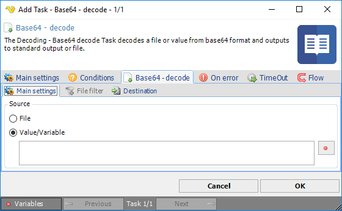
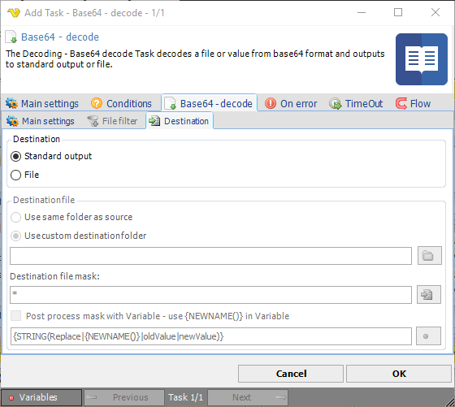

## Task File - Base64 - Decode

The Decoding - Base 64 - decode Task decodes a file or value from Base64 format and outputs to standard output or file.

**Source**

Select File if you want to decode an existing file. When selecting File, the standard VisualCron [File filter](../../../server/job-tasks-file-filter) will be enabled. Select Value/Variable to use an existing value or Variable.
 
**Base64 - decode > Destination** sub tab

**Destination**

Select **File** if you want to save the decoded content to file or select *Standard output* to pass the value to the output of the Task.
 
**Destination file**

You can choose to save files to same folder as where the original file was found by selecting *Use same folder* as source. If you select *Use custom destination folder* you are able to select a different destination folder for the saved file than source folder.
 
**Destination file mask**

Destination file mask is a quick way to change the file name to something else. By default it is using * which means that the same file name will be used for destination folder. If you are going to use `*` you need to use another destination folder. If you for example know it is a text file want to change the original extension from "`.enc`" instead you can change this destination file mask to "`*.txt`".
 
**Post process mask with Variable**

This property gives you more advanced ways to change the file name. We recommend that you use Destination file mask with value `*` when using this property. When checking this property the new name will be stored in a temporary variable `{NEWNAME()}`. You will be able to use this Variable for processing with other Variable functions. As an example we have provided the default value for this property: `{STRING(Replace|{NEWNAME()}|oldValue|newValue)}`. The example uses the String.Replace method from the Variables window. It uses the `{NEWNAME()}` as input Variable with options to set a value that you want to replace from original file name "oldValue" and the new value "newValue".