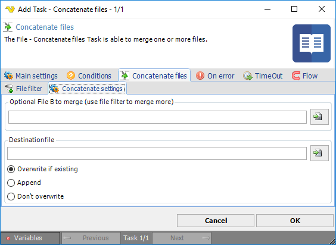

## Task File - Concatenate Files

The File - Concatenate files Task is able to merge one or more files.
 
**Concatenate files > File filter > Location** sub tab
This Task uses the file filter to find one or more files to merge. Optionally, a specific file can be used (File B)
 
**Concatenate files > Concatenate settings** sub tab

**Optional File B**

You use the file filter to merge one or more files. Optionally, another file can be added. Specify the full path here.
 
**Destination file**

Enter the full path where the merged file should be saved to
 
**Overwrite settings**

You can control what happens if the file already exists:

* Overwrite if existing - overwrites the existing file
* Append - merges the new file with the existing
* Don't overwrite - skips the current operation and lets the current file be