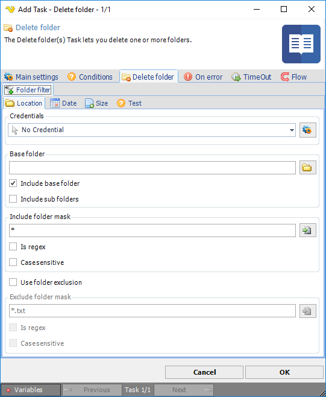

## Task File - Delete Folders

The Delete folder(s) Task lets you delete one or more folders.

This Task is using the standard VisualCron [Folder filter](../../../server/job-tasks-folder-filter) to find one or more folders.

