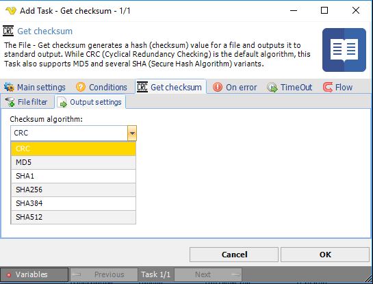

## Task File - Get Checksum

The File - Get checksum generates a hash (checksum) value for a file and outputs it to standard output. While CRC (Cyclical Redundancy Checking) is the default algorithm, this Task also supports MD5 and several SHA (Secure Hash Algorithm) variants.
 
**Get checksum > File filter > Location **sub tab
The standard VisualCron [File filter](../../../server/job-tasks-file-filter) is used to specify one or more files you want to retrieve the checksum for.
 
**Get Checksum > Output settings** sub tab

**Checksum algorithm**

Indicates the algorithm to use during calculation. The available options are:

* CRC (default): Cyclical Redundancy Checking. Fastest and least secure.
* MD5: Message Digest 5. Slower and more secure than CRC.
* SHA1: Secure Hash Algorithm-1. Slower and more secure than MD5.
* SHA256: Secure Hash Algorithm-256. Slower and more secure than SHA1.
* SHA384: Secure Hash Algorithm-384. Slower and more secure than SHA256.
* SHA512: Secure Hash Algorithm-512. Slowest and most secure.
