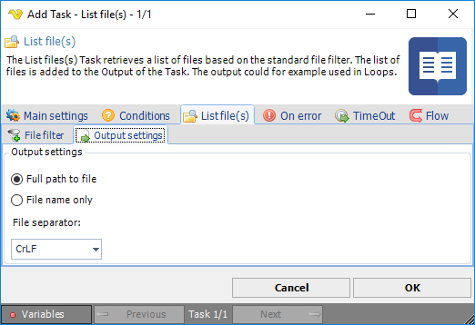

## Task File - List File(s)

The List files(s) Task retrieves a list of files based on the standard file filter. The list of files is added to the Output of the Task.
 
The main purpose of this Task is to use it for looping. For example, you could run this Task against a directory first - then use the output in the For Each loop type. The Loop will then iterate through all found files and each file can be accessed through the Loop Variables.
 
**List file(s) > File filter > Location** sub tab

The List file(s) Task uses the standard VisualCron [File filter](../../../server/job-tasks-file-filter) to define the properties of the listed files.
 
**List file(s) > Output setting**s sub tab

**Output settings**

List file settings includes path and file separator options.