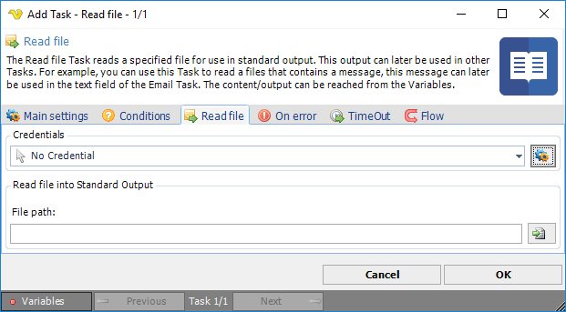

## Task File - Read File

The Read file Task reads a specified file for use in standard output. This output can later be used in other Tasks. For example, you can use this Task to read a file that contains a message, this message can later be used in the text field of the Email Task. The content/output can be reached from the Variables.

**Credentials**

To control a remote computer you may need to use a Credential. The Credential must match the user name and password of the user that you want to login for. Select a Credential in the combo box or click the Settings icon to open Manage credentials in order to add or edit Credentials.
 
**File path**

Select a path to the file you want to read.
 
:::info Note 

The output size is limited in VisualCron by default. To increase or remove the output limit go to the Server Settings.

:::