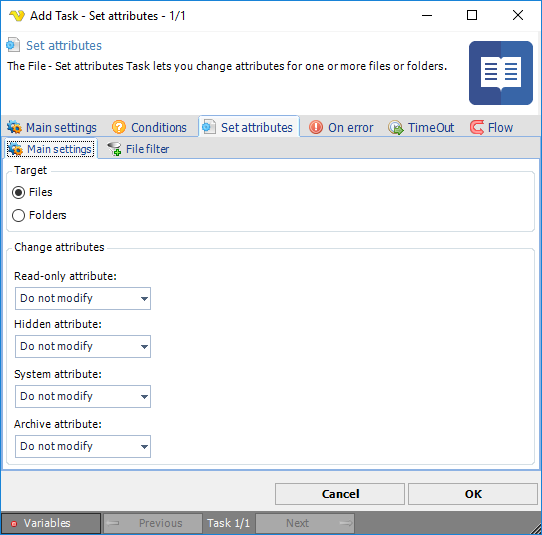

## Task File - Set Attributes

The File - Set attributes Task lets you set attributes for one or more folders or files.
 
**Set attributes > Main settings** sub tab

**Target**

Select if you want to target by File or Folder. If you set Folder you use the Folder Filter Dialog and it will use the base folder (and sub folders if you select that). If you select Files you use the File filter dialog.
 
**Change attributes**

Select an attribute and if you want to turn on or off the attribute based on the files that are found.
 
**Set attributes > File filter > Location **sub tab

The standard VisualCron [File filter](../../../server/job-tasks-file-filter) is used to specify one or more files or folders you want to retrieve set attributes for.
