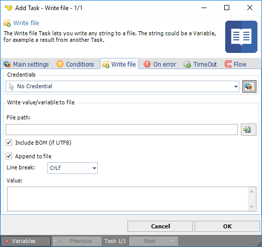

## Task File - Write File

The Write file Task lets you write any string to a file. The string could be a Variable, for example a result from another Task.

**Credential**

To control a remote computer you may need to use a Credential. The Credential must match the user name and password of the user that you want to login for. Select a Credential in the combo box or click the Settings icon to open Manage credentials in order to add or edit Credentials.
 
**File path**

The path to the file you want to write to.
 
**Include BOM (if UTF8)**

If checked, the byte order mark character is included in the start of the text stream
 
**Append to file**

Check this box if you to add rows to an existing file. If you want to overwrite the file please leave this unchecked.
 
**Add new line**

When appending you can check this if you want to add a new line for each string/value you add.
 
**Value**

The string/variable that you want to write to the file.