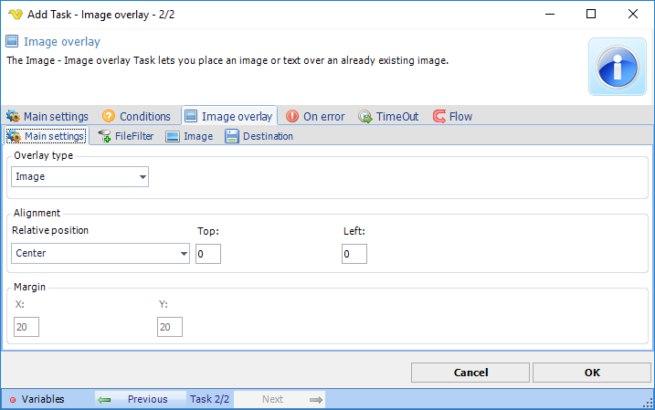
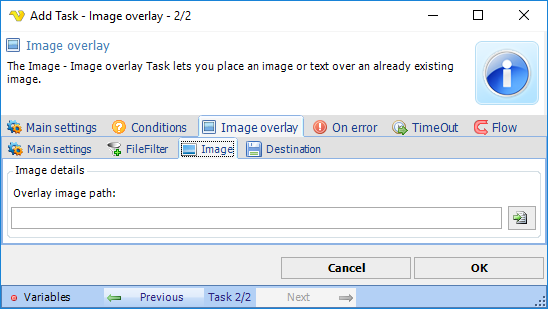
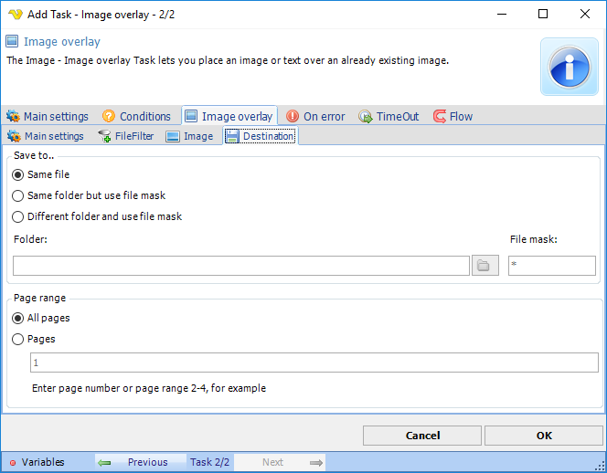

## Task Image - Overlay

The Image overlay Task lets you place an image or text over an already existing image.

**Overlay type**

Specify Image or text.
 
**Alignment**

Position of the image to overlay.
 
**Image overlay > File filter > Location** sub tab

In the File filter tab you define which file to be overlayed. Read more about file filter [here](job-tasks-file-filter).
 
**Image overlay > Image** sub tab

**Overlay image path**

Defines the path and file name of the the image to overlay.
 
**Image overlay > Destinatio**n sub tab

**Save to**

Enter destination file and folder names.
 
**Folder**

If *Different folder* and *use file mask* is selected, use manual folder specification or click the *Folder* icon.
 
**File mask**

Save file with different name.
 
**Page range**

Defines image pages to be overlayed.