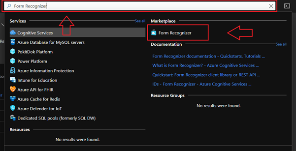
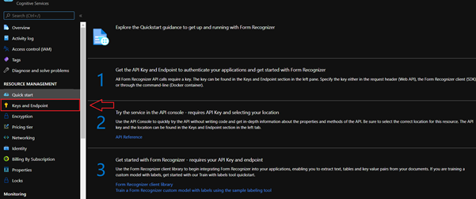
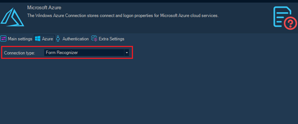
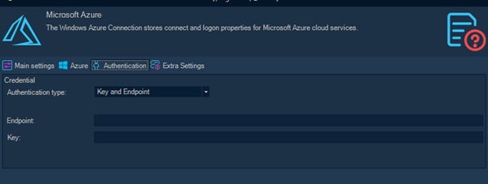
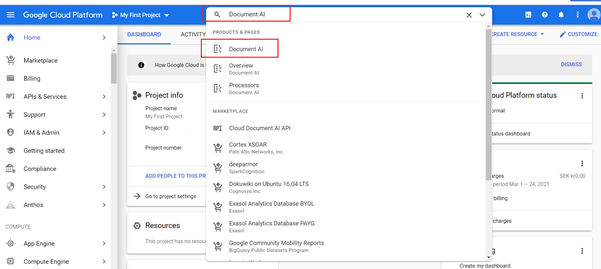
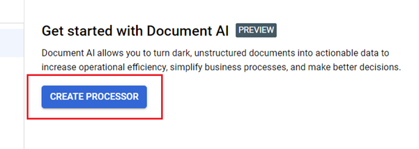
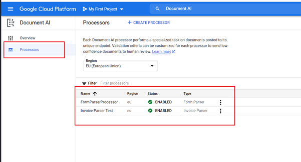
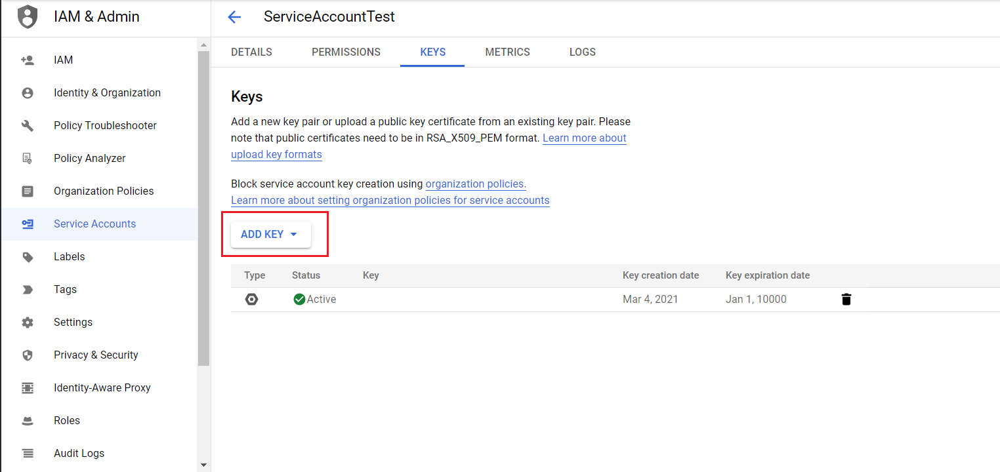
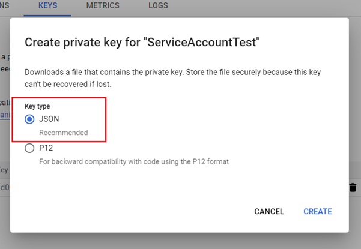
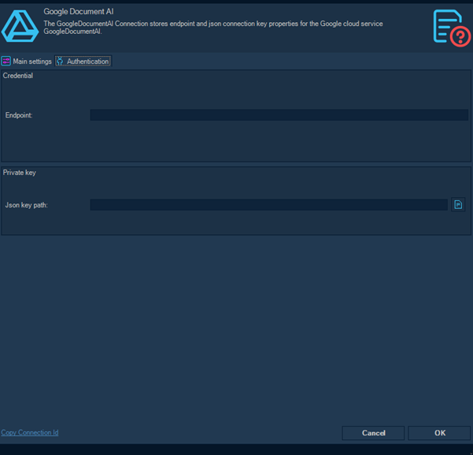

## Task Image - Scan Document (Cloud)

The Task Image - Scan document (cloud) is able to utilize cloud services for scanning documents like invoices, purchase orders and other forms. These Cloud services uses AI to make the scanning as exact as possible and to be able to find and extract the most common fields for every document type.
 
Currently the following Cloud services (and VC Connections) are supported:
 
* [Azure](../../../server/connection-microsoft-azure)
* [Google](../../../server/connection-google-cloud)
 
You need to sign up to one of these services in order to use this Task.
 
**How it works**

1. VisualCron detects and reads and incoming file
2. VisualCron upload this file (with settings for scanning) to the selected Cloud service
3. The Cloud service extracts the field and return the result to VisualCron
4. VisualCron stores these field values as Variables that can be easily accessed in follow up Tasks
 
## Setting up Cloud services
 
 
### Azure
 
In the Microsoft Azure portal search for "Form Recognizer"

Click on “Form Recognizer” and create new Form Recognizer Service.
After creating Form Recognizer Service, select it from your Azure Dashboard and then select “Keys and Endpoint”:

Here you can find key and endpoint for creating new Visual Cron connection. Now in Visual Cron you can create new connection of type “Microsoft Azure”. In Microsoft Azure connection form select Connection type as “Form Recognizer”:

In Authentication tab you can paste your Endpoint and Key:

Then specify Name of connection and click OK. Now this connection is ready to be used in Scan Document (cloud) Task.
 
### Google
 
First in Google Cloud Platform search for “Document AI” and click on it:

Then create a new processor:

Then in Document AI dashboard you can select existing processor and copy endpoint from there:

After that you should create Google Service Account. Details on how to do that can be found here [https://cloud.google.com/iam/docs/creating-managing-service-accounts](https://cloud.google.com/iam/docs/creating-managing-service-accounts).

Then in KEYS tab of your service account you should create a new json key:

After that the json key should be downloaded to your PC. And now you can use endpoint and json key to create new VisualCron connection.

