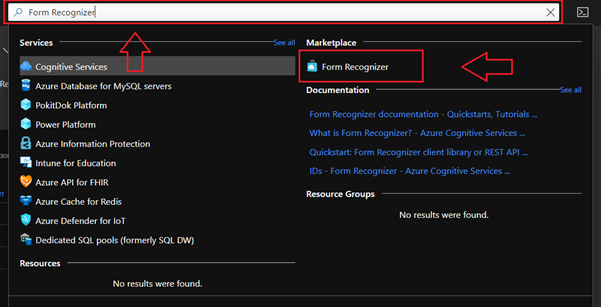
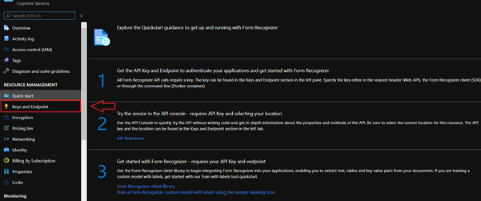
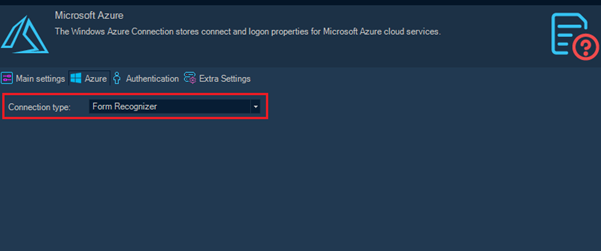
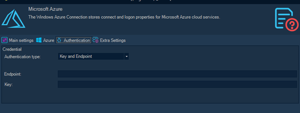
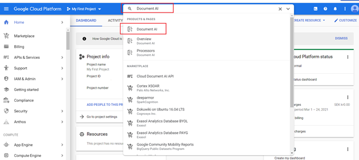
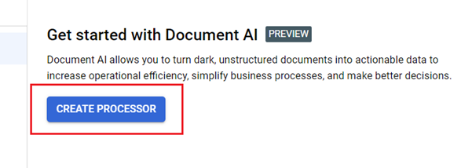
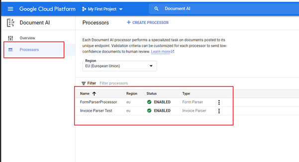
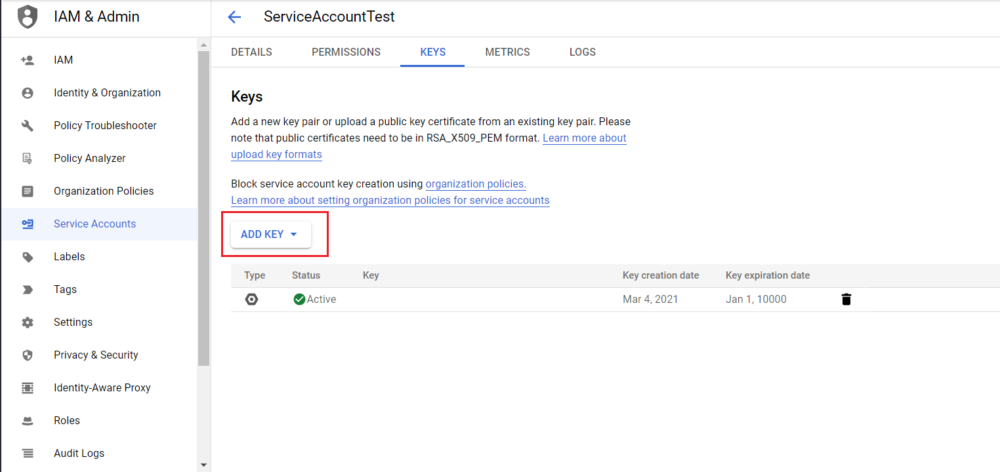
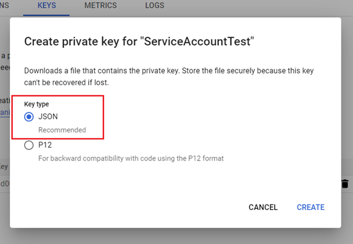
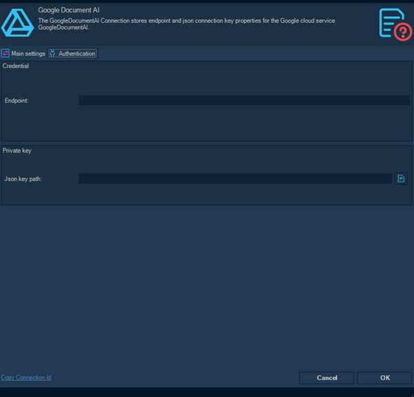

## Task Image - Scan Document (Cloud)

The Task Image - Scan document (cloud) is able to utilize cloud services for scanning documents like invoices, purchase orders and other forms. These Cloud services uses AI to make the scanning as exact as possible and to be able to find and extract the most common fields for every document type.
 
Currently the following Cloud services (and VC Connections) are supported:
 
* [Azure](../../../server/connection-microsoft-azure)
* [Google](../../../server/connection-google-cloud)
 
You need to sign up to one of these services in order to use this Task.
 
**How it works**

1. VisualCron detects and reads and incoming file
2. VisualCron upload this file (with settings for scanning) to the selected Cloud service
3. The Cloud service extracts the field and return the result to VisualCron
4. VisualCron stores these field values as Variables that can be easily accessed in follow up Tasks
 
## Setting up Cloud services
 
 
### Azure
 
In the Microsoft Azure portal search for "Form Recognizer"

Click on “Form Recognizer” and create new Form Recognizer Service.
After creating Form Recognizer Service, select it from your Azure Dashboard and then select “Keys and Endpoint”:

Here you can find key and endpoint for creating new Visual Cron connection. Now in Visual Cron you can create new connection of type “Microsoft Azure”. In Microsoft Azure connection form select Connection type as “Form Recognizer”:

In Authentication tab you can paste your Endpoint and Key:

Then specify Name of connection and click OK. Now this connection is ready to be used in Scan Document (cloud) Task.
 
### Google
 
First in Google Cloud Platform search for “Document AI” and click on it:

Then create a new processor:

Then in Document AI dashboard you can select existing processor and copy endpoint from there:

After that you should create Google Service Account. Details on how to do that can be found here [https://cloud.google.com/iam/docs/creating-managing-service-accounts](https://cloud.google.com/iam/docs/creating-managing-service-accounts).

Then in KEYS tab of your service account you should create a new json key:

After that the json key should be downloaded to your PC. And now you can use endpoint and json key to create new VisualCron connection.

**Scan document (cloud) > File filter** sub tab

The Scan document (cloud) Task uses the [File filter](../../../server/job-tasks-file-filter) to find the file to process.

**Scan document (cloud) > Scan properties** sub tab

The Scan properties tab is where you configure the cloud provider and interact with the document being scanned.

**Fields/Variables**

Displays the fields extracted from the document. Each row represents a variable that will be available after the scan.

**Provider Connection**

Select the cloud provider connection to use for scanning. Connections are configured in the [Connections](../../../server/global-connections) settings.

**Document type**

Select the type of document to scan. The available document types depend on the selected cloud provider and its configured processors.

**Scan**

Click the **Scan** button to upload the file to the cloud service and retrieve extracted field values.

**Variable output settings**

This section is collapsed by default. Expand it to configure how scanned field values are output.

**Field separator**

Controls what character separates each field in the output.

**Text qualifier**

The character used to surround a field value in the output. Normally nothing, which is the default.

**Line break**

Controls what type of line break is used in the output.

**Output to Task Variable**

Saves the result as a Task Variable, available in the Result node of the Task.

**Output to Job Variable**

Saves the result as a Job Variable, accessible from other Tasks in the same Job.

**Output to file**

Saves the result to a file. Configure the file location and options in the **File output settings** section below.

**File output settings**

**Credential**

The credential to use when writing to the output file.

**File path**

The full path and file name where the output will be saved.

**Include BOM (if UTF8)**

When enabled, a byte order mark is included in the output file when using UTF-8 encoding.

**Append to file**

When enabled, the output is appended to the existing file rather than overwriting it.
