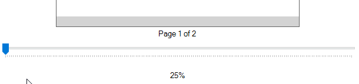
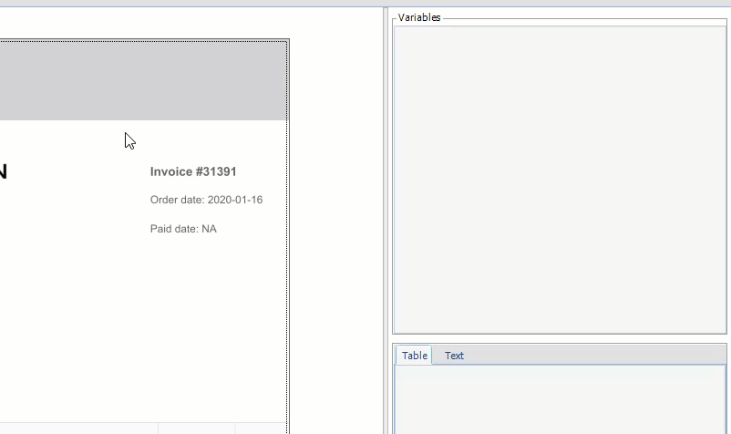
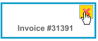
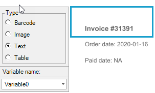
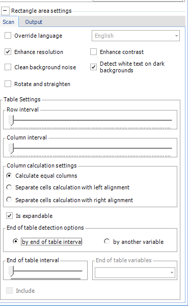
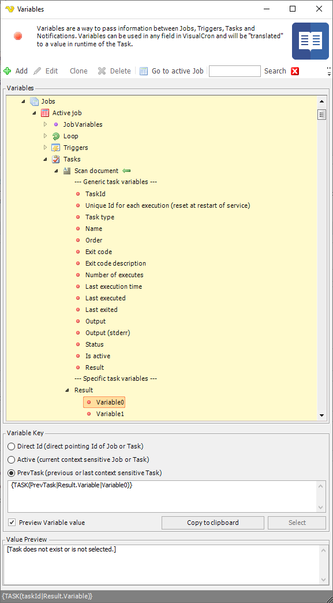

## Task Image - Scan Document (Local)

The Scan document Tasks lets you automate text, barcode and image scanning. It is possible to select individual parts of document and VisualCron will scan and save the content. Text will be available as Variables and it is possible to save images to file.
 
The following document and image formats are supported:
 
* PDF
* Word (doc,docx)
* HTML
* TIFF (multi page)
* JPG
* GIF
* PNG
 
**File filter tab**

The Scan document Task is built to process one file at a time. It is using the [File filter](../../../server/job-tasks-file-filter) for finding the file to process. It will only use the first found file in the [File filter](../../../server/job-tasks-file-filter). The reason for this is that output and Variables is tied to the file that is processed. If you have several documents of same kind to process you should put the Task in a [loop](../../../server/job-tasks-loop-functionality) or base it on a [File Trigger](../../../server/event-trigger-file) for example that will run the Task once for each file.
 
 
**Scan properties tab**

In the Scan properties tab you define which areas (rectangles) are going to be processed for scanning and how to save the content of those rectangles.
 
**Open document/image**

To start with selection you need to have a document or image to start with. Click on the Open document/image button to select a sample file to work with. After selection, the file is loaded into the view. If it is a multipage document/image you are able to alter page to work on based with the Previous page and Next page buttons.
 
**Zoom slider**

There is a zoom slider in the bottom of the page that lets you zoom in to be able to clearer see text. The current zoom level does not affect the scanning itself - it is just a way to more easily select text and view content.

**Document area**

The document area is the place where you see the loaded document. The *Zoom slider* controls the zoom of the document. Use the left mouse button to move around the document in the area.
 
To create a *rectangle* for scanning you right click at top left location of text and "draw" the rectangle to the lower right corner of the text. Once you release the mouse the rectangle becomes orange and scanning icon is shown - VisualCron is now previewing the scan. Once done the *rectangle* will turn blue and automatically a *Variable* will be created in the right *Variables* area. Also, the Variable itself will be selected. When this happens the content of the scan (the result) will be loaded in the *Table* and *Text* tab below the *Variable*s area.

When hovering over a *rectangle* the *Delete* icon will be visible. Click there or on the *Delete* icon in the *Variables* section to delete the *rectangle*.

When selecting a rectangle the scan type selection will be shown to the left and the Scan settings to the right will be updated.

A rectangle have 4 different scan types and VisualCron try to auto detect the scan type when scanning but this can be changed after by selecting a different scan type radiobox.
 
* Barcode - convert any barcode image to a Variable
* Image - save any rectangle as image to a file
* Text - save text to a Variable Variable (as displayed)
* Table - save text in comma separated (or configurable table format) to a Variable.
 
**Preview of Variables**

The Preview Variable component is divided into Table and Text representation of the *Variable*. The *Table* representation is important when using *Scan type->Table* because it is able to show the result of the table settings. It is possible to affect the row and column calculation on sliders to be able to force VisualCron into split and understand content better. These sliders exist in *Rectangle->Scan settings*.
 
**Language**

Language selection might be important to interpret special characters of a language. Default is English. In the *General language settings* you set the general language detection for the document but it is possible to override this on rectangle level.
 
**Rectangle area settings**

In the rectangle settings you set specific scan settings for a rectangle area.
 
**Scan tab**

This tab controls the specific scan settings for the rectangle area.
 
* Override language - you are able to override the default language for a certain rectangle.
* Enhance resolution - re-renders low quality images at a higher DPI. This works faster and more accurately with high resolution images. Useful for images scanned at under 250 DPI.
* Clean background noise - this will clean background 'noise' , dust, speckles and signs of paper away from printed text. Works even scrupled, stained or damaged paper. RotateAndStraighten is a powerful tool, making imperfect scans OCR accurately. CPU/GPU intensive.
* Rotate and straigthen - this will deskew and rotate images to be straight, upright, unbent and without perspective. RotateAndStraighten is a powerful tool, making imperfect scans OCR accurately. CPU/GPU intensive.
* Enhance contrast - enhances image contrast adaptively, which generally increases text readability both by humans ans machines.
* Detect white text on dark background - automatically detects and adjusts white text on darker backgrounds such as found in microfilm, negatives and some styles of graphic design.
 
**Table settings**

Table settings are used to control how VisualCron should interpret a table in a document.
 
**Row interval**

Specifies the distance between rows at which the new line of text should be considered as part of the previous row.

**Column interval**

Specifies the distance between cells at which the new characters on row should be considered as part of the previous cell on row.

**Calculate equal columns**

When selected the table will have columns.
 
**Separate cells calculation with left alignment**

When selected, the table will not have shared columns, but each row will have its own collection of cells. And all cells will be aligned to the left in Output and Table Preview.
 
**Separate cells calculation with right alignment**

When selected, the table will not have shared columns, but each row will have its own collection of cells. And all cells will be aligned to the right in Output and Table Preview.
 
**Is expandable**

When selected implies that the specific end of the table is not fixed and is calculated dynamically depending on which of the following options is selected.
 
**End of table detection options**
 
* by end of table interval - Defines the end of the table using the "End of table interval" parameter.
* by another variable - Defines the end of the table by looking for text marked with another rectangle.
* Using “by another variable” option is shown in images below:
 
**End of table interval**

Taken into account if "by end of table interval" option selected. Specifies the distance between lines of text that the table is considered complete if it exceeds. For example, if a new line of text is further from the previous line of text at a distance greater than the "end of the table interval", then the previous line of text is considered the end of the table.

**Include**

Taken into account if "by another variable" option selected. If on, the variable selected as the “End of the table variable” will be included in the table.
 
**Output settings tab**

The output settings tab controls what we do with the scanned result and how we save the result.

.png)

**Text result**

* Field separator - here you can control what separates each field.
* Text qualifier - the text qualifier is the parts surrounding a field. Normally nothing which is default.
* Line break - controls what type of line break should be used.
 
**Location for saving value**

* Output to Task Variable - the Variable is available in the Result node of the Task.
* Output to Job Variable - the Variable is added as a Job Variable in the Job.
* Output to file - the Variable is saved to file. You control where to save in the File output settings.
 
**Variables**

When scanning to Task you find the result below in the Variables browser:

