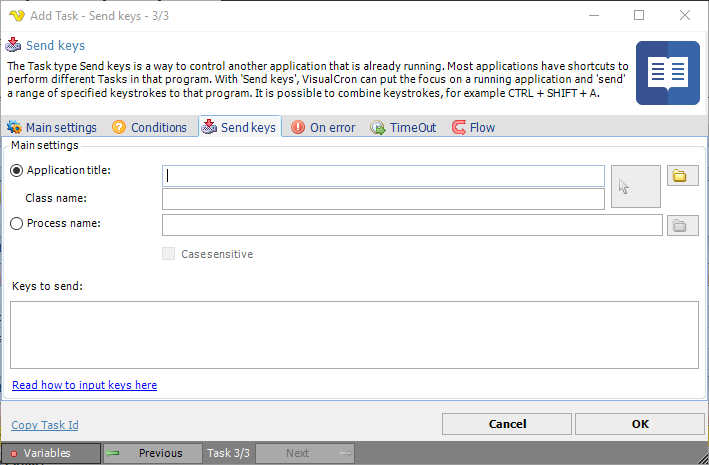

## Task Interactivity - Send Keys

The Task type Send keys is a way to control another application that is already running. Most applications have shortcuts to perform different Tasks in that program. With "Send keys", VisualCron can put the focus on a running application and "send" a range of specified keystrokes to that program. It is possible to combine keystrokes, for example CTRL + SHIFT + A.

**Application title**

To be able to send keys, VisualCron needs to have the application title or the process name. Enter title name or open Active *window titles* by clicking on the *select*. Note that this retrieves application titles from computer where the server reside. This function does not search child windows. This function does not perform a case-sensitive search. You can also hold drag the *arrow* button over a specific window. Release the button when you have selected the window.
 
**Class name**

When dragging the *arrow* button you get more exact information on what window you want to reach - so use the drag functionality when you can. Class name is one of the properties used when sending keys to a window.
 
**Process name**

Some programs change their application title and it would then be better to fetch the main window from the process name instead of the application title. Write the process name or click on button ... to retrieve a list from the server.
 
**Case sensitive**

If you want your search of processes to be case sensitive the check this option.
 
**Keys to send**

These are the keystrokes you want to send. Look below for more information.
Most keyboard characters are represented by a single keystroke. Some keyboard characters are made up of combinations of keystrokes (CTRL+SHIFT+HOME, for example). To send a single keyboard character, send the character itself as the string argument. For example, to send the letter x, send the string argument "x".
 
:::tip Note 1 

To send a space, send the string " ".

:::

You can use Send keys to send more than one keystroke at a time. To do this, create a compound string argument that represents a sequence of keystrokes by appending each keystroke in the sequence to the one before it. For example, to send the keystrokes a, b, and c, you would send the string argument "abc".
 
The Send Keys method uses some characters as modifiers of characters (instead of using their face-values). This set of special characters consists of parentheses, brackets, braces, and the:

* **plus** - "`+`"
* **caret** - "`^`"
* **percent** - "`%`"
* **tilde** - "`~`".

Send these characters by enclosing them within braces "{}". For example, to send the plus character, send the string argument "`{+}`".
 
Brackets "`[ ]`" have no special meaning when used with SendKeys, but you must enclose them within braces to accommodate applications that do give them a special meaning (for dynamic data exchange (DDE) for example):

* To send bracket characters, send the string argument "`{[}`" (left bracket) and "`{]}`" (right bracket)
* To send brace characters, send the string argument "`{{}`" (left brace) and "`{}}`" (right brace)
 
Some keystrokes do not generate characters (such as `ENTER` and `TAB`). Some keystrokes represent actions (such as `BACKSPACE` and `BREAK`). To send these kinds of keystrokes, send the arguments shown in the following table:

| Key | {Argument} |
| --- | ---------- |
| BACKSPACE | {BACKSPACE}, {BS}, or {BKSP} | 
| BREAK | {BREAK} | 
| CAPS LOCK | {CAPSLOCK} | 
| DEL or DELETE | {DELETE} or {DEL} | 
| DOWN ARROW | {DOWN} | 
| END | {END} | 
| ENTER | {ENTER} or ~ |
| ESC | {ESC} | 
| HELP | {HELP} | 
| HOME | {HOME} | 
| INS or INSERT | {INSERT} or {INS} |
| LEFT ARROW | {LEFT} | 
| NUM LOCK | {NUMLOCK} | 
| PAGE DOWN | {PGDN} |
| PAGE UP | {PGUP} | 
| PRINT SCREEN | {PRTSC} |
| RIGHT ARROW | {RIGHT} | 
| SCROLL LOCK | {SCROLLLOCK} |
| TAB | {TAB} |
| UP ARROW | {UP} |
| F1 | {F1} |
| F2 | {F2} | 
| F3 | {F3} |
| F4 | {F4} | 
| F5 | {F5} | 
| F6 | {F6} | 
| F7 | {F7} | 
| F8 | {F8} | 
| F9 | {F9} | 
| F10 | {F10} |
| F11 | {F11} | 
| F12 | {F12} | 
| F13 | {F13} | 
| F14 | {F14} | 
| F15 | {F15} | 
| F16 | {F16} |
 
To send keyboard characters that are comprised of a regular keystroke in combination with a SHIFT, CTRL, or ALT, create a compound string argument that represents the keystroke combination. You do this by preceding the regular keystroke with one or more of the following special characters:

| Key | Special Character |
| --- | ----------------- |
| SHIFT | + | 
| CTRL | ^ |
| ALT | % |
 
:::tip Note 2 

When used this way, these special characters are not enclosed within a set of braces.

:::

To specify that a combination of SHIFT, CTRL, and ALT should be held down while several other keys are pressed, create a compound string argument with the modified keystrokes enclosed in parentheses.
For example, to send the keystroke combination that specifies that the SHIFT key is held down while:

* e and c are pressed, send the string argument "+(ec)"
* e is pressed, followed by a lone c (with no SHIFT), send the string argument "+ec"
 
You can use the *SendKeys* method to send a pattern of keystrokes that consists of a single keystroke pressed several times in a row. To do this, create a compound string argument that specifies the keystroke you want to repeat, followed by the number of times you want it repeated. You do this using a compound string argument of the form {keystroke number}. For example, to send the letter "x" ten times, you would send the string argument "{x 10}". Be sure to include a space between keystroke and number.
 
:::tip Note 3 

The only keystroke pattern you can send is the kind that is comprised of a single keystroke pressed several times. For example, you can send "x" ten times, but you cannot do the same for "Ctrl+x".

:::

:::tip Note 4 

You cannot send the PRINT SCREEN key {PRTSC} to an application.

:::