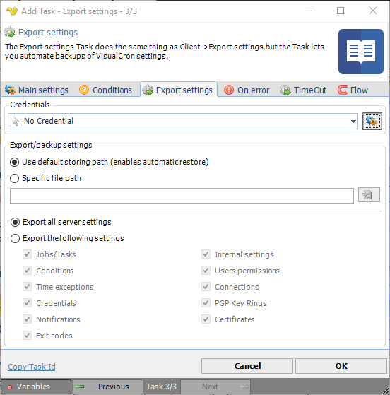

## Task Internal - Export Settings

The Export settings Task does the same thing as Client File > Import/Export > Export settings but this Task lets automatically backup the VisualCron settings.
 
VisualCron uses a number of XML files to store settings, these are located in the VisualCron settings folder (by default installation: C:\Program Files (x86)\VisualCron\settings). Export/backup is performed by the VisualCron Server that you are currently connected to. You may Export settings across the Internet.
 
It is recommended to perform regular backups/exports to this file. If a setting error occurs and a backup exists in the default backup file path, VisualCron will use the backup file and automatically restore settings. It is a recommendation that you keep a backup file both in the default folder and in another place.
 
VisualCron is automatically adding a Job with the *Export settings* Task and it is a recommendation to keep this Task in your Job list.

**Credential**

To control a remote computer you may need to use a Credential. The Credential must match the user name and password of the user that you want to login for. Select a Credential in the combo box or click the *Settings* icon to open *Manage credentials* in order to add or edit Credentials.
 
**Use default storing path**

The default file for Export is C:\Program Files\VisualCron\backup\VC-Settings.zip.
 
**Specific file path**

If you want to store your backup file in another place or with another name, then enter the full file path here.
 
**Export all server settings**

It is recommended that you backup all settings. Check this radio button to backup all settings. This option is default.
 
**Export the following settings**

This option lets you select which settings to export.