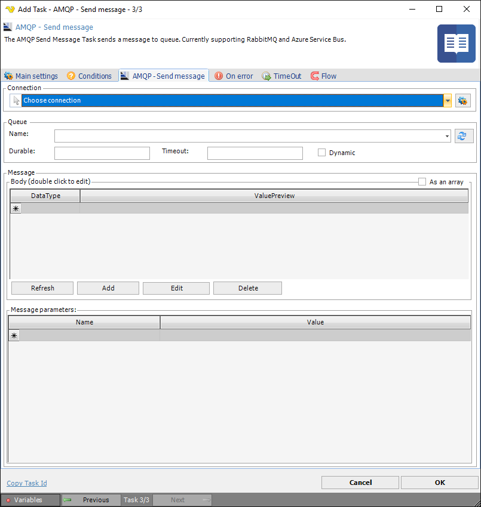
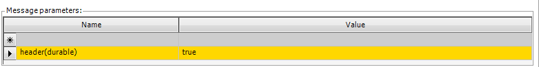

## Task Messaging - AMQP - Send Message

AMQP - Send message Task sends a message to any of the supported message queue protocols that AMQP protocol supports. Currently;
 
 * Azure Service Bus
 * RabbitMQ
 
 
The AMQP Task uses the [AMQP Connection](../../../server/connection-amqp).

**Name**

Name of the queue. Click refresh to get all once you have selected a Connection.
 
**Durable**

Indicates what state of the terminus will be retained durably: the state of durable messages, only existence and configuration of the terminus, or no state at all.
 
**Timeout**

Timeout duration that an expiring source will be retained. The source starts expiring as indicated by the expiry-policy.
 
**Dynamic**

Dynamic request dynamic creation of a remote node. When set to true by the receiving link endpoint, this field constitutes a request for the sending peer to dynamically create a node at the source. In this case the address field MUST NOT be set. When set to true by the sending link endpoint this field indicates creation of a dynamically created node. In this case the address field will contain the address of the created node. The generated address SHOULD include the link name and other available information on the initiator of the request (such as the remote container-id) in some recognizable form for ease of traceability.
 
**Message body**

The body consists of one of the following three choices: one or more data sections ("As an array" is set), one or more amqp-sequence sections ("As an array" is not set), or a single amqp-value section.
 
**Message parameters**

The message parameters are configured in the table, the name of the parameter is specified in the Name field in the form array name(parameter name), possible values ​​for the array name:
 
* Header
* Footer
* Properties
* ApplicationProperties
* DeliveryAnnotations
* MessageAnnotations
 
The Header array has the following parameters:
 
* Durable
* Priority
* Ttl
* FirstAcquirer
* DeliveryCount
 
The Properties array has the following parameters:
 
* GroupId
* CreationTime
* AbsoluteExpiryTime
* ContentEncoding
* ContentType
* CorrelationId
* ReplyTo
* GroupSequence
* Subject
* UserId
* MessageId
* To
* ReplyToGroupId
 
The remaining arrays do not have predefined parameters.
  
**Delivery mode**

You can force durable delivery mode by setting the following parameter:

