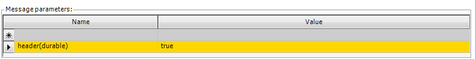

## Task Messaging - AMQP - Send Message

The AMQP - Send message Task sends a message to any of the message queue services that support the AMQP protocol. Currently:

* Azure Service Bus
* RabbitMQ

The AMQP Task uses the [AMQP Connection](../../../server/connection-amqp).

**Name**

Name of the queue to send the message to. Click the *Refresh* icon to populate the drop-down with available queues from the selected Connection.

**Durable**

Indicates what state of the terminus is retained durably: the state of durable messages, only the existence and configuration of the terminus, or no state at all.

**Timeout**

Timeout duration that an expiring source will be retained. The source starts expiring as indicated by the expiry policy.

**Dynamic**

Requests dynamic creation of a remote node. When set to true by the receiving link endpoint, this field constitutes a request for the sending peer to dynamically create a node at the source — in this case the address field MUST NOT be set. When set to true by the sending link endpoint this field indicates creation of a dynamically created node — in this case the address field will contain the address of the created node. The generated address SHOULD include the link name and other available information on the initiator of the request (such as the remote container-id) in some recognizable form for ease of traceability.

**Message body**

The body of the message. The body consists of one of the following: one or more data sections (when *As an array* is set), one or more amqp-sequence sections (when *As an array* is not set), or a single amqp-value section. Use the *Add*, *Edit* and *Delete* buttons to manage the body parts.

**As an array**

When checked, the message body parts are sent as data sections; when unchecked, they are sent as amqp-sequence sections. Available when there is at least one body part.

**Message parameters**

Additional message parameters configured in a name/value table. The parameter name is specified in the form `array-name(parameter-name)`. Possible array names:

* Header
* Footer
* Properties
* ApplicationProperties
* DeliveryAnnotations
* MessageAnnotations

The Header array supports the following parameter names:

* Durable
* Priority
* Ttl
* FirstAcquirer
* DeliveryCount

The Properties array supports the following parameter names:

* GroupId
* CreationTime
* AbsoluteExpiryTime
* ContentEncoding
* ContentType
* CorrelationId
* ReplyTo
* GroupSequence
* Subject
* UserId
* MessageId
* To
* ReplyToGroupId

The remaining arrays do not have predefined parameter names.

**Delivery mode**

You can force durable delivery mode by adding a `Header(Durable)` parameter set to `true`:

