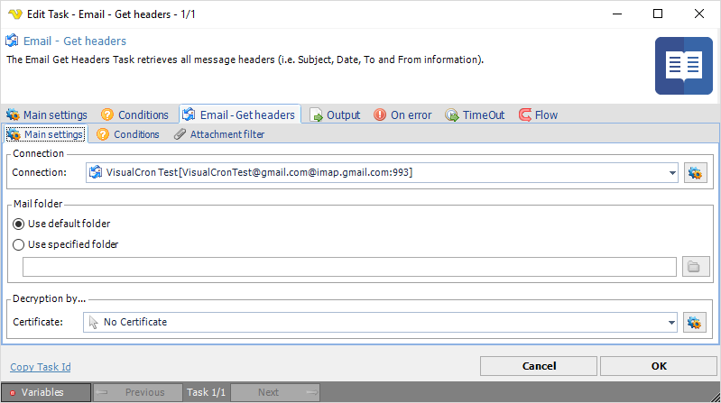
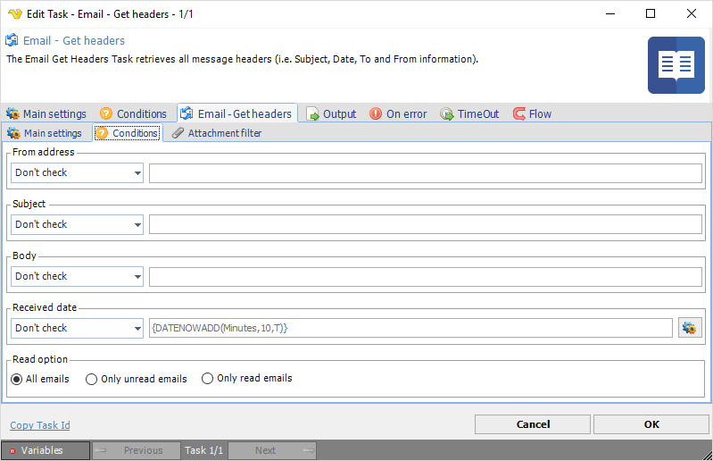
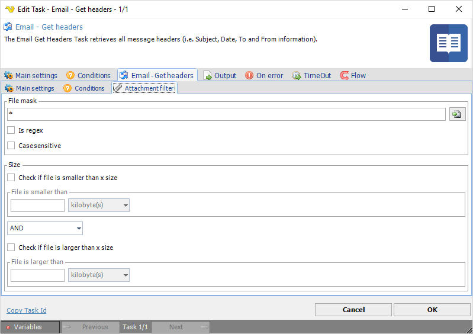

## Task Messaging - Email - Get Headers

The Messaging - Email - Getheaders Task retrieves all message headers (i.e. Subject, Date, To and From information.
 
**Email - Get headers > Main settings** sub tab

**Connection**

To use Email Tasks you need to create a [Connection](../../../server/global-connections) first. Click the Settings icon to open the Manage Connections dialog.
 
**Mail folder**

If desired, change to Use specified folder and use manual folder specification or click the Folder icon.
 
**Decryption by**

If email decryption is used, enter certificate name.
 
**Email - Get headers > Conditions** sub tab

**From address, Subject, Body, Received date**

If desired, filter email options for different items as selected by the individual drop-down lists. Please note that Body->Contains searches on whole words and cannot search on part of words.
 
**Read option**

If desired, filter by read state.
 
**Email - Get headers > Attachment filter** sub tab

**File mask**

If desired, filter attachment by file mask. Click the File icon to open to browse for an existing file mask file.
 
**Size**

If desired, filter by attachment size.