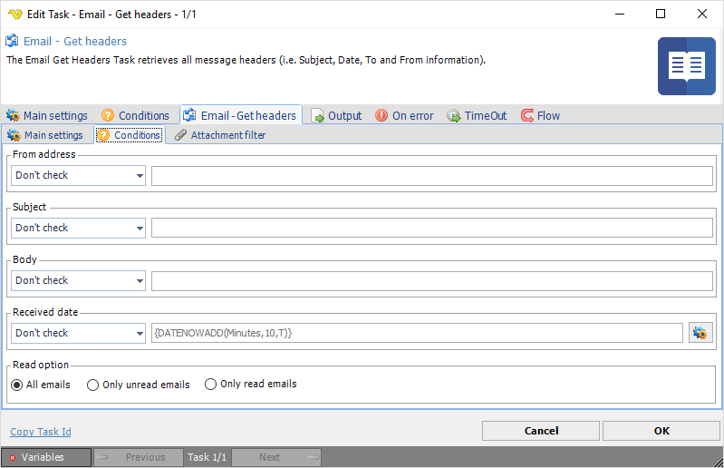
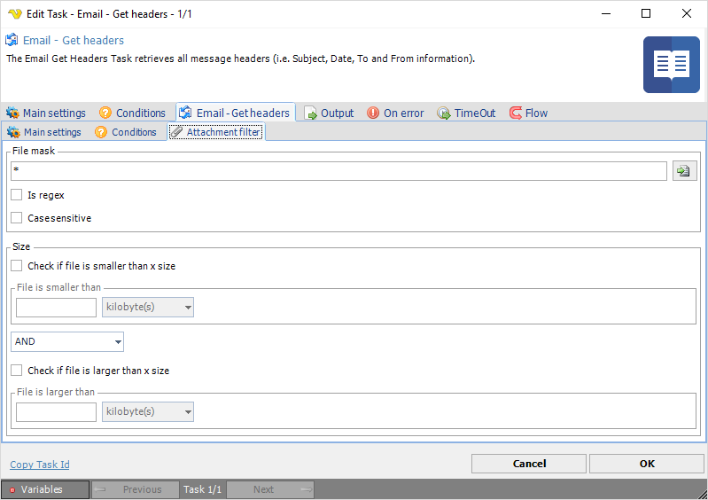

## Task Messaging - Email - Get Headers

The Messaging - Email - Getheaders Task retrieves all message headers (i.e. Subject, Date, To and From information.

:::tip Supported protocols

This task supports **POP3**, **IMAP4**, **Exchange EWS**, and **Microsoft Graph** connections. When using a Microsoft Graph connection, the task queries the Graph API and supports server-side filtering via OData for improved performance on large mailboxes.

:::

**Email - Get headers > Main settings** sub tab

**Connection**

To use Email Tasks you need to create a [Connection](../../../server/global-connections) first. Click the Settings icon to open the Manage Connections dialog. Supported connection types: [POP3](../../../server/connection-pop3), [IMAP4](../../../server/connection-imap4), [Exchange EWS](../../../server/connection-exchange-ews), and [Microsoft Graph](../../../server/connection-microsoft-graph).

**Mail folder**

If desired, change to Use specified folder and use manual folder specification or click the Folder icon. When using Microsoft Graph, you can specify a folder by display name (e.g., `Inbox`, `Archive`) or by folder path. VisualCron resolves the folder name to the Graph folder ID automatically.

**Decryption by**

If email decryption is used, enter certificate name.

**Email - Get headers > Conditions** sub tab

**From address, Subject, Body, Received date**

If desired, filter email options for different items as selected by the individual drop-down lists. Please note that Body->Contains searches on whole words and cannot search on part of words.

When using a Microsoft Graph connection, the following condition filters are pushed to the server as OData queries for faster performance:

* **From address** — Equal, Not equal, Contains, Don't contain
* **Subject** — Equal, Not equal, Contains, Don't contain
* **Read option** — filter by read/unread state

Body filters and Received date filters are evaluated client-side after retrieval.

**Read option**

If desired, filter by read state.

**Email - Get headers > Attachment filter** sub tab

**File mask**

If desired, filter attachment by file mask. Click the File icon to open to browse for an existing file mask file.

**Size**

If desired, filter by attachment size.
