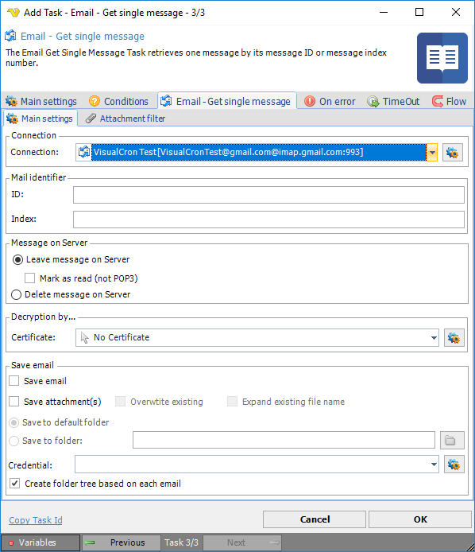

## Task Messaging - Email - Get Single Messages

The Email Get Single Message Task retrieves one message by its ID or message index number.
 
**Email - Get single message > Main setting**s sub tab




**Connection**

To use Email Tasks you need to create a [Connection](../../../server/global-connections) first. Click the *Settings* icon to open the *Manage Connections* dialog.
 
**Mail identifier**

Specify mail ID or index number for message that is to be retrieved.
 
**Message on server**

If desired, change message on server options.
 
**Decryption by**

If email decryption is used, enter certificate name.
 
**Save email**

If desired, change save email options. For credential, click the *Settings* icon to open the *Manage Credentials* dialog.
 
:::tip Note

Note when forming the folder name and file name in which the message is saved, all incorrect characters in mail ID are replaced with the � symbol.
The final folder and/or file name can be calculated by applying the built-in variable function "*File variables / Encode FileName*" to mail ID as follows: ```{PATH(EncodeFileName|Mail_ID_from_Task_settings|MASK)}```.
 
:::

**Email - Get single message > Attachment filter** sub tab
See the [Task Messaging - Email - Get headers](email-get-headers) > **Email - Get headers > Attachment filter** sub tab