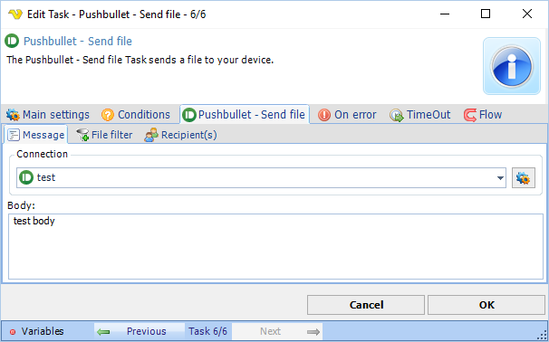

## Task Messaging - Pushbullet - Send File

The Pushbullet - Send file Task allows you to send a file to any contact and/or your own device and/or channel.

**Connection**

Select an existing global [Pushbullet Connection](../../../server/connection-pushbullet) for storing connection credentials.
 
**Body**

The message associated with the file being sent.
 
**Pushbullet - Send file > File filter** sub tab

Use the standard [File filter](../../../server/job-tasks-file-filter) to select one or more files to send.
 
**Pushbullet - Send File > Recipients** sub tabs

With Pushbullet you can send to a Contact or a Channel. If you have selected a Connection these will refresh and you will be able to select on or more recipients.
