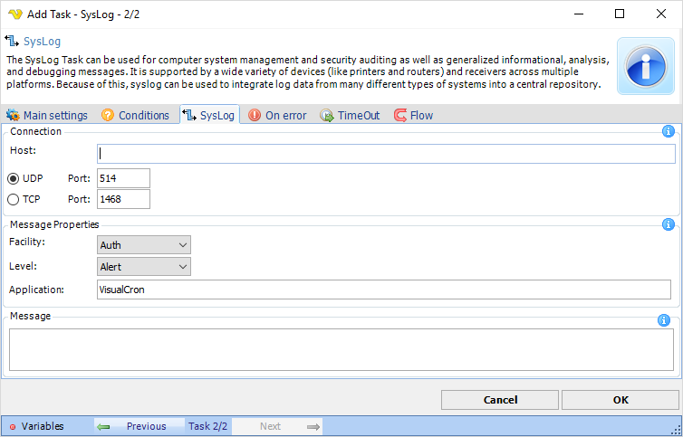

## Task Messaging - SysLog

The SysLog Task can be used for computer system management and security auditing as well as generalized informational, analysis and debugging message. It is supported by a wide variety of devices (like printers and routers) and receivers across multiple platforms. Because of this, SysLog can be used to integrate log data from many different types of systems into a central repository.

**Host**

Host name to connect to.
 
**Message properties**

Type of message to be sent.
 
**Message**

The Syslog message to be sent.