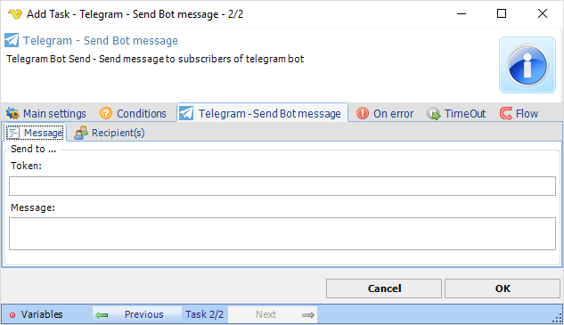

## Task Messaging - Telegram - Send Bot Message

Telegram Bot Send - Send message to subscribers of Telegram bot. Please read more about Telegram bots [here](https://core.telegram.org/bots).

**Send to Token**

Use the token from creating a new bot [here](https://core.telegram.org/bots#6-botfather).
 
**Message**

The message you want to send.
 
### Troubleshooting
 
**Recipient is not visible**

Please note that you need to send first message manually to user in order to see recipient in Recipients tab.