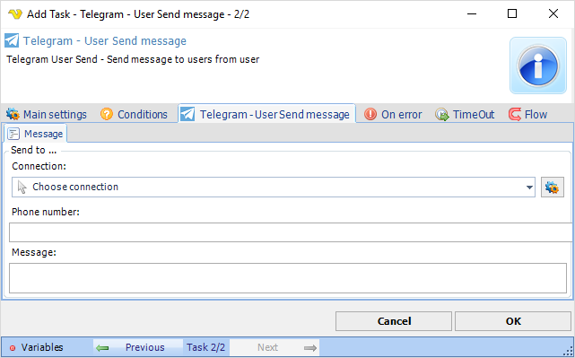

## Task Messaging - Telegram - User Send Message

Telegram User Send - Send message to users from user.

**Send to Connection**

Select and existing [Telegram Connection](../../../server/connection-telegram).
 
**Send to Phone number**

The phone number of the user you want to send to including country code like; +1888555222
 
**Message**

The message you want to send.