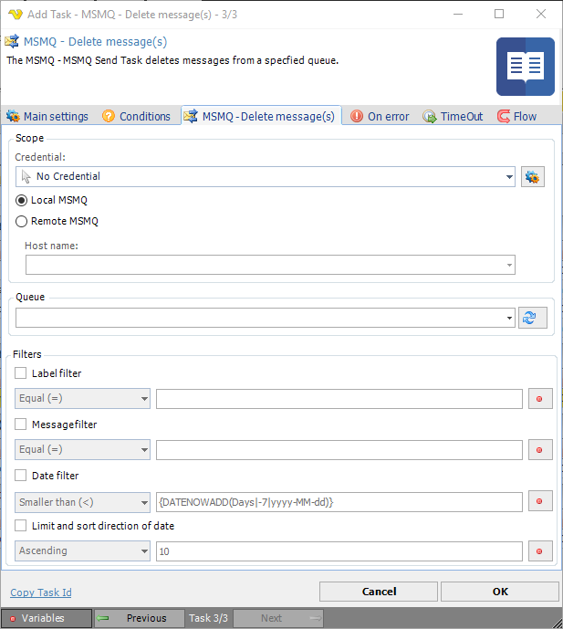

## Task MSMQ - Delete Message

The MSMQ - Delete message Task deletes messages from a specified queue.

**Credential**

To control a remote computer you may need to use a Credential. The Credential must match the user name and password of the user that you want to login for. Select a Credential in the combo box or click the *Settings* icon to open *Manage credentials* in order to add or edit Credentials.
 
**Local MSMQ**

Select this radio button if the activity will be performed on the local computer.
 
**Remote MSMQ**

Select this radio button if the activity will be performed on a remote computer.
 
**Host name**

The host name or IP address of the remote computer.
 
**Queue**

The name of the queue to retrieve the message from. Click the *Refresh* icon to populate the drop-down list of message queue names.
 
**Filters**

The filter settings for label, message text, date and sort direction of date to be used for deletion. Click on the Variables icons to select appropriate variables for the filter.
