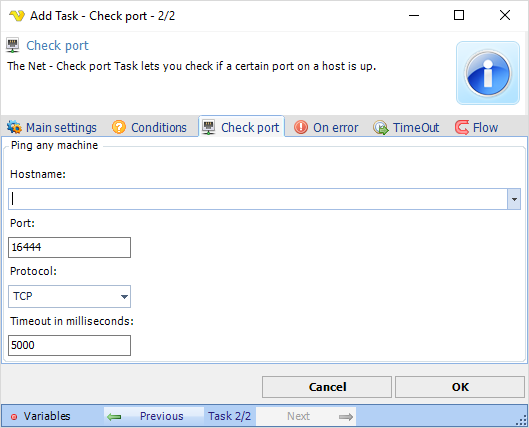

## Task Net - Check Port

The Net - Check port Task lets you check if a certain port on a host is up.

**Hostname**

The IP address or host name of the server you want to check port for.
 
**Port**

Port number to be used.
 
**Protocol**

Type of protocol to be used.
 
**Timeout in milliseconds**

Timeout before the reply is considered too long. Produces error if longer than timeout.