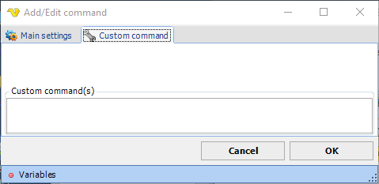

## Command - Custom Command

Custom commands can be sent. This can be useful if you need to send a command which is not implemented in VisualCron. However, not all commands are supported by all FTP servers. In order to determine which commands are supported, you can the send the "HELP" command (and turn on output logging from the connection).
 
**Custom command** sub tab

Enter the commands separated by new lines in the text box.
