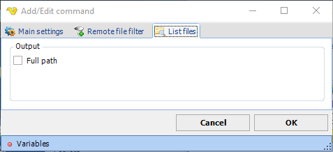

## Command - List Files

For list files, VisualCron uses the [remote file filter](../../../server/job-tasks-remote-file-filter) to specify files that should be listed.

**List files** sub tab

**Output**

Disable or enable Full path for listed files