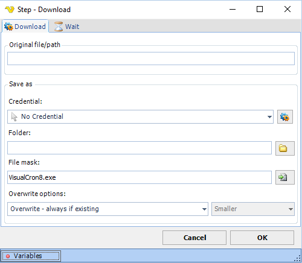

## Download Step

The Download step is triggered automatically when a web page presents something for download - this could be initiated originally by a click.

**Download tab**

**Original file/path**

The direct URL to download from. Required when **Force download** is checked.

**Force download**

When checked, downloads directly from the URL specified in the Original file/path field. When unchecked, the Element tab becomes available and the download is triggered by clicking a web element.
 
**Credential**

If you need to save the file on a network resource you probably need a Credential to elevate the rights. Use an existing or add [one](client-user-interface/server/global-credentials.md).
 
**Folder**

The local destination folder where the file will be saved.
 
**File mask**

The destination file name or file mask.
 
**Overwrite options**

Controls what happens when a file with the same name already exists at the destination. Options:

* **Overwrite - always if existing** (default) — always replace the destination file
* **Overwrite - if destination size is** — replace based on size comparison (activates the size dropdown)
* **Do not overwrite if existing** — skip the file if it already exists

**Overwrite size**

Active only when **Overwrite options** is set to "Overwrite - if destination size is". Options: Same, Smaller, Larger, Smaller or larger, Different.

**Element tab**

Available when **Force download** is unchecked. Defines the web element to click in order to trigger the download. Supports three selection modes: Relative (by element path), By position (X/Y coordinates), and By search (selector, attribute, regex, and position).

**Variable tab**

**Save local path to Variable**

When checked, saves the local path of the downloaded file to a variable. Configure the target variable in the fields below.
 
**Wait tab**

Controls how long the step waits before and after performing the action.
