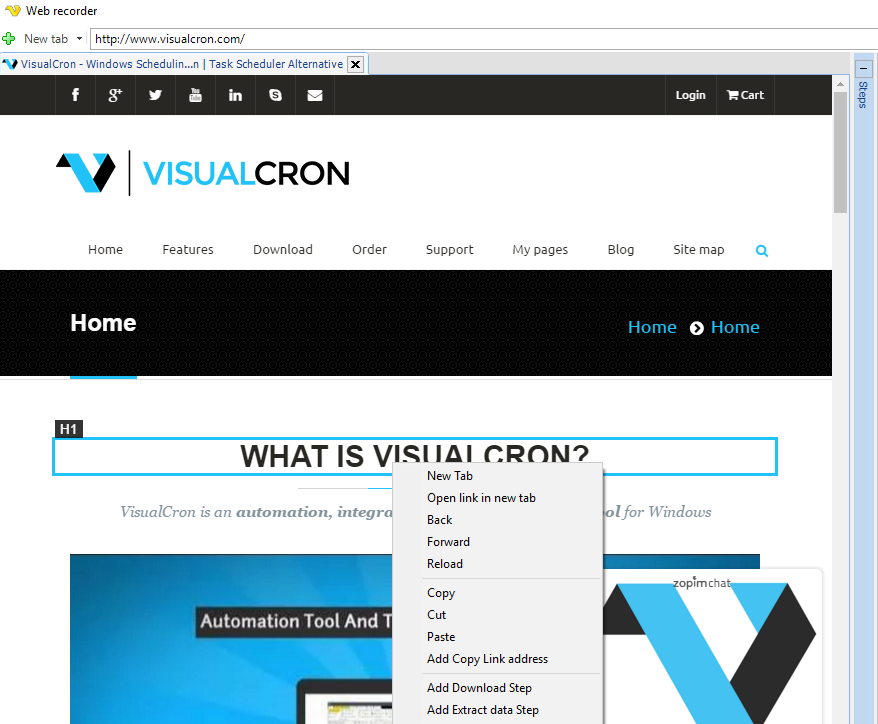
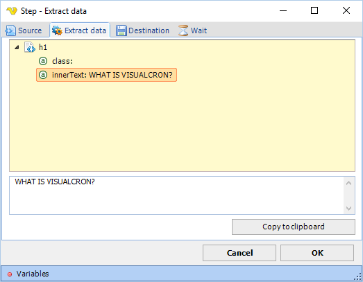
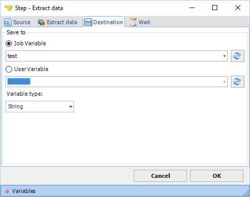

## Extract Data Step

The Extract Data step extracts an attribute value from a web page element and optionally saves it to a variable.

**Source tab**

Defines the web element to extract data from. Uses the standard element selection interface. See [Element Path](element-path.md) for details on how to specify the element.

**Extract data tab**

Displays a tree view of the selected element and its attributes. Select an attribute in the tree to populate the value preview field on the right. Click **Copy to clipboard** to copy the displayed value.
To extract a certain attribute you right click on it and chose Add Extract data step below:

**Destination tab**

Defines where to save the extracted attribute value. Configure the target variable in the fields below.

Select the attribute you want to extract below:

**Job Variable**

When selected, saves the result to a job variable. Select the target variable from the dropdown. Click the Refresh button to reload the list of available variables.

Set where you want to save the attribute value (in which Variable):

**User Variable**

When selected, saves the result to a user variable. Select the target variable from the dropdown. Click the Refresh button to reload the list of available variables.

**Wait tab**

Controls how long the step waits before and after performing the action.

