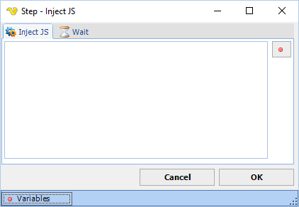

## Inject JS Step

The Inject JS step lets you send javascript code for execution on the current page.

**Inject JS tab**

**Script code**

The JavaScript code to execute on the page. Click the **Variables** button to insert a VisualCron variable into the script.

**Wait tab**

Controls how long the step waits before and after performing the action.
