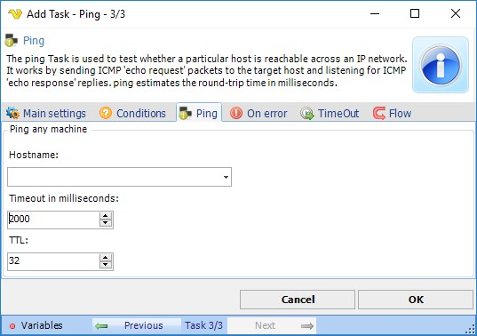

## Task Net - Ping

The ping Task is used to test whether a particular host is reachable across an IP network. It works by sending ICMP “echo request” packets to the target host and listening for ICMP “echo response” replies. ping estimates the round-trip time in milliseconds.

**Hostname**

The IP address or host name of the server you want to PING.
 
**Timeout in milliseconds**

Timeout before the reply is considered too long. Produces error if longer than timeout.
 
**TTL**

Time to live (sometimes abbreviated TTL) is a limit on the period of time or number of iterations or transmissions in computer and computer network technology that a unit of data (e.g. a packet) can experience before it should be discarded. Use a value between 1 and 255.
