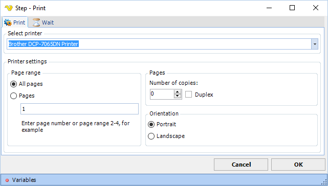

## Print Step

The Print step prints the current page(s). You add this step by either right clicking in web browser or click on the Print icon in toolbar.

The Print step exposes the most common printer settings.
 
**Wait tab**

The wait tab controls how long time the step should wait before performing the step and after performing the step (in milliseconds).