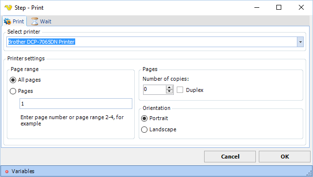

## Print Step

The Print step prints the current page using the configured printer settings.

The Print step exposes the most common printer settings.
 
**Print tab**

**Select printer**

The printer to use. Select from the dropdown list of printers available on the system.

**Page range**

Controls which pages are printed.

**All pages**

When selected, prints all pages. Default is selected.

**Pages**

When selected, prints only the pages specified in the adjacent field. Enter a page number or a page range, for example 2-4.

**Number of copies**

The number of copies to print. Default is 1.

**Duplex**

When checked, prints on both sides of the page. Default is unchecked.

**Orientation**

Controls the page orientation.

**Portrait**

When selected, prints in portrait orientation. Default is selected.

**Landscape**

When selected, prints in landscape orientation.

**Wait tab**

Controls how long the step waits before and after performing the action.
