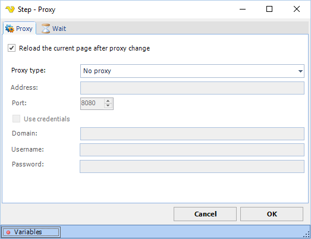

## Proxy Step

The Proxy step lets you change the proxy being used during run time. It overrides any previous set proxy in the Task.

**Proxy tab**

**Reload the current page after proxy change**

When checked, reloads the current page after the proxy change takes effect. Default is unchecked.

**Proxy type**

The type of proxy to use. Options: No proxy (default), HTTP Proxy, SOCKS4, SOCKS5. When set to No proxy, all other proxy fields are disabled.

**Address**

The proxy server address. Active when proxy type is not No proxy.

**Port**

The proxy server port. Active when proxy type is not No proxy.

**Test url**

A URL used to test the proxy connection. Click **Test** to verify that the proxy is reachable. Active when proxy type is not No proxy.

**Authentication**

The HTTP authentication method to use. Options: Basic (default), Digest, NTLM, Not set. Active only when proxy type is HTTP Proxy.

**Use credentials**

When checked, enables the Domain, Username, and Password fields for proxy authentication. Active when proxy type is not No proxy. Default is unchecked.

**Domain**

The domain for proxy authentication. Active when **Use credentials** is checked and proxy type is not No proxy.

**Username**

The username for proxy authentication. Active when **Use credentials** is checked and proxy type is not No proxy.

**Password**

The password for proxy authentication. Active when **Use credentials** is checked and proxy type is not No proxy.

**Use proxy for data channel**

When checked, routes the data channel through the proxy. Visible and active when proxy type is not No proxy. Default is unchecked.

**Wait tab**

Controls how long the step waits before and after performing the action.
