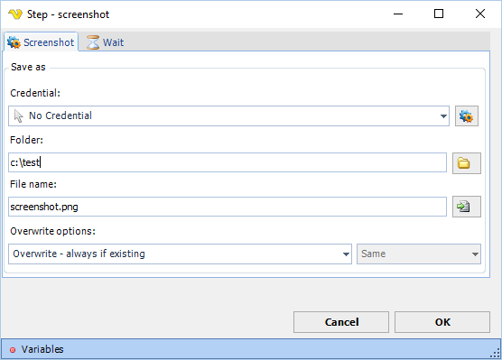

## Screenshot Step

The Screenshot step takes a screenshot of the current web browser and saves it to a file.

**Screenshot tab**

**Credential**

If the destination folder is on a network resource, select a credential to provide the necessary access rights. Use an existing or add [one](client-user-interface/server/global-credentials.md).

**Folder**

The local destination folder where the screenshot file will be saved. Click the browse button to select a folder.

**File name**

The destination file name. Click the browse button to select an existing file name.

**Overwrite options**

Controls what happens when a file with the same name already exists at the destination. Options:

* **Overwrite - always if existing** (default) — always replace the destination file
* **Overwrite - if destination size is** — replace based on size comparison (activates the size dropdown)
* **Do not overwrite if existing** — skip the file if it already exists

**Overwrite size**

Active only when **Overwrite options** is set to "Overwrite - if destination size is". Options: Same, Smaller, Larger, Smaller or larger, Different.

**Screenshot type**

Controls what area of the browser is captured. Options: Window (default), Page.

**Screenshot size**

Controls the capture area. Options:

* **Full** (default) — captures the full screenshot type area
* **Part** — captures a rectangular region defined by the fields below

**Relative position and size of rectangle**

Active only when **Screenshot size** is set to Part. Specify the X and Y coordinates of the top-left corner of the rectangle, and its Width and Height in pixels.

**Wait tab**

Controls how long the step waits before and after performing the action.
