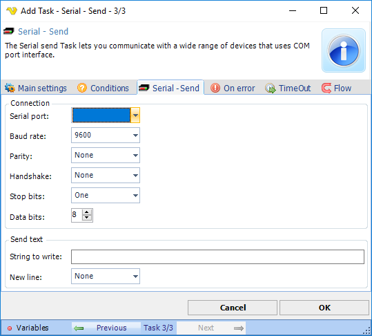

## Task Net - Serial Send

The Serial send Task lets you communicate with a wide range of devices that uses COM port interface.

**Connection**

Serial connection parameters of the device to connect to.
 
**Send text**

Text to send to the device by connection.

