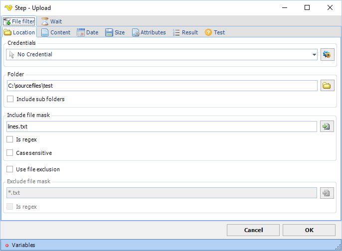

## Upload Step

The upload file step is created wherever you select a file to upload in a web page. What is important to know that the step is created there but then you can later edit the step to make it more dynamic.

The upload step uses the same [file filter](../../../server/job-tasks-file-filter) as the rest of VisualCron application.
 
**Wait tab**

The wait tab controls how long time the step should wait before performing the step and after performing the step (in milliseconds).