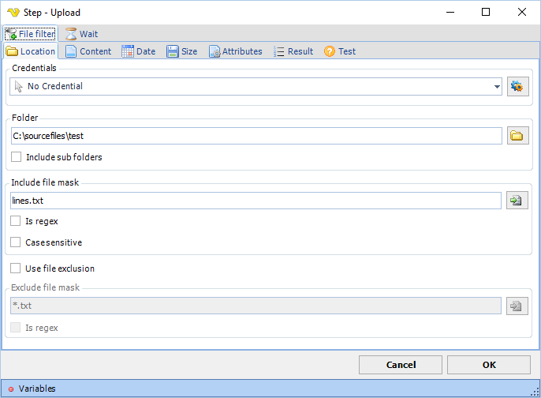

## Upload Step

The Upload step uploads one or more files from the local file system as part of a web macro. The step is created automatically when a file upload interaction is recorded, and can be edited afterwards to make the file selection more dynamic.

**File filter tab**

Specifies the files to upload using the standard VisualCron [file filter](../../../server/job-tasks-file-filter).

**Wait tab**

Controls how long the step waits before and after performing the action.
