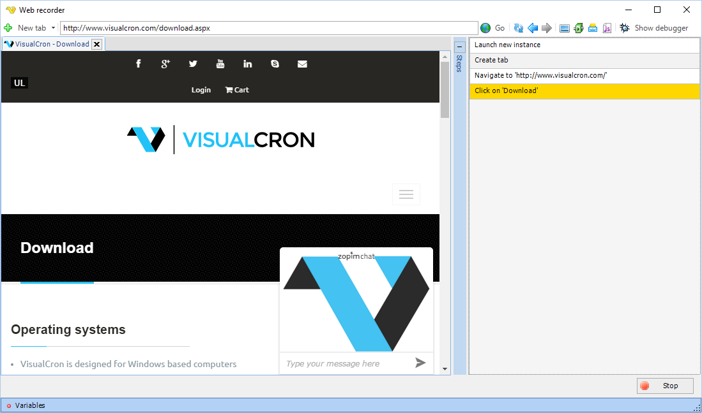

## Task Net - Web Macro

The Net - Web macro Task is able to record actions in the built in browser and later play it back in the background at any time.

Below are some features of the Web Macro Task in VisualCron:

* The playback is based on Chrome which gives you speed and compatiblity - also, Chrome plugins are supported (not Extensions but Pepper plugins)
* The playback of web recordings are done from a Windows service which requires zero interaction from a user – no one is required to be logged on. This means that multiple instance can be running at the same time and you can work on the computer at the same time without disturbing the background playback.
* Passwords are stored in an encrypted format VisualCron uses file filters, Variables, stored Credentials to dynamically present values (like dates).
* VisualCron can handle many web instances at the same time and copy/paste data between
* VisualCron handles popup windows.
* VisualCron supports uploading and downloading files – dynamically with file filters VisualCron supports proxy and proxy change anytime during the automation which helps if you want to create unique web requests.
* In VisualCron you can import Client certificates and they will be presented upon request.
* VisualCron supports multiple tabs and switching between tabs.
* When creating a tab you can choose to browse with Incognito mode.
* You are able to Print and take a screen shot (save to file).
* VisualCron lets you set any User-Agent you like VisualCron lets you inject JS anywhere in a page.
* VisualCron lets you override HTTP referrer.
* VisualCron lets you set Accept-Language.
* VisualCron lets you set GoogleId to support Google Speech and other APIs from Google
* VisualCron lets you control speed of playback, from typing text to waiting before and after a step.
 
**Web macro > Main settings** tab


**Load images**

Controls if the browser should load images or not. If you deselect this loading of page will be faster. Do not deselect this if you are dependent on images.
 
**Block popups**

When a popup to a new window occurs VisualCron will open that new window in a new tab. If you do not want this behavior you can check Block popups.
 
**Lite mode**

Enabling this disables "rectangle"-selection and other more javascript intensitive actions when recording.
 
**Disable WebSecurity**

This is affecting Same-origin policy. Please see more information [here](https://en.m.wikipedia.org/wiki/Same-origin_policy).
 
**Override User-Agent**

By default, the User-Agent of the current Chrome version is sent. If you want to override this you check this property and enter your User-Agent in text field.
 
**Store cookies**

Optionally VisualCron can store the cookies between each call. This is create if you first want to record entering some security questions. First check Store cookies, then record once entering the security questions. Then record again and any cookies from previous record will exist in memory.
 
**Pass cookies between Tasks in Job session**

Optionally, when checking this, the cookies will be passed to other Web macro Tasks to keep any session cookies open etc.
 
**Constantly update previews**

When checked VisualCron will update the step preview images when running.
 
**Extended Variables**

This turns on and off sync of Variables. This property is subject to change.
 
**Override referer**

By default, the last page visited is sent as referer. If you want to override this you check this property and type in any referer you want to use in the text field.
 
**Accept-Language**

By default, English with US location Accept-Language will be sent. This might give you different results back (depending on developers of web page), for example how time and date is presented or which language a page is presented in. If you want a specific Accept-Language to be sent you can alter this here.
 
**Google API**

A number of features supported by the Chrome browser engine relies on certain Google API to function. For example, the location service relies on Google Map's GEO location service API, and speech recognition relies on Google's Speech API. In order to use these features, you must acquire and apply your Google API keys first.
 
Follow the steps below to acquire your Google API keys. Note that due to Google frequently updates their systems, the exact UI/step may be slightly different.

1. Visit [https://console.developers.google.com/](https://console.developers.google.com/) and login with your Google account;
2 .If you have not already created a project, you will be prompted to create a project;
3. After you have created a project, click "Use Google APIs" from the project's Dashboard;
4. Make sure the corresponding API is enabled. For example, to use speech recognition feature, you must enable "Speech API";
5. Select "Credentials" from the list on the left side, click "Create Credentials" -> "API Key" -> "Browser Key" to create an API key;
 
**GoogleClientID**

Your Google Client ID.
 
**GoogleAPIKey**

Your Google API key.
 
**GoogleClientSecret**

Your Google Client secret.
 
### Recording a web macro

Click on the Record button to start recording. This open the Web macro recorder window (see screenshots and description later down).
 
### Playing back a web macro

A web macro can be played back in both Client and Server. If you press Play it starts playing back in Client. You can also press Pause to stop playback.
 
**Web macro > Steps** tab


The Steps tab contains all recorded steps. Some of them can be edited/deleted by double clicking on Step or select and click Edit. Adding a step manually is currently not possible.
 
**Set wait for all steps**

Each Step has a Before and After step wait time in milliseconds. If you want to increase or decrease this on all steps you can click this button and set these values for all steps.
 
**Auto-creation of steps and adding manually**

Steps are auto-created during recording but it also possible to manually add some steps by clicking on toolbar or right click on an element in the browser.
 
**Web macro > Proxy** tab


The proxy tab lets you set the default proxy to use in all tabs. You can override this by adding the Set proxy step.
 
**Web macro > Certificates** tab


**Certificates**

The web macro Task supports handling of both Client and Server Certificates. The Client certificates are globally managed in [Manage Certificates](../../../server/global-certificates) window. Add a client certificate - the will be presented to remote server when needed. By default all remote server certificates are accepted. We recommend this option checked to prevent playback issues.
 
**Web macro > Plugins** tab


There are two different type of plug-in standard: NPAPI and PPAPI. NPAPI originates from Netscape and were supported by all major browsers until Google developed PPAPI. The Chromium project (upon which both Google Chrome browser is built) has been supporting both for a while until finally it dropped NPAPI support. a result, VisualCron does not support NPAPI either.
 
**To install Flash**

1. Visit [http://get.adobe.com/flashplayer/](http://get.adobe.com/flashplayer/) with Google Chrome browser;
2. Look for "To download the Adobe® Flash® Player system plug-in, click here" in the page. Follow the link to the download page. If you can not find the link, then Adobe may have moved the page after this documentation was written. In that case please contact us or use this direct link:
[http://get.adobe.com/flashplayer/?fpchrome](http://get.adobe.com/flashplayer/?fpchrome)
3. Check "Your System" section, click "Need Flash Player for a different computer?";
4. Select the correct Windows version, then select the "PPAPI" version from the drop down box. Do NOT select "NPAPI". These are two different type of plug-in interfaces. The current version of VisualCron only supports PPAPI;
5. Click "Download Now" to download install the Flash Player system plug-in. This will install the plug-in inside sub directory "```Macromed\Flash```" under your Windows system32 or SysWOW64 directory;
6. VisualCron should auto detect the plug-in next time you record. If not, specify the folling folder in plugin text field: ```C:\Windows\SysWOW64\Macromed\Flash```
 
**Auto scan common plugins**

Indicating whether to automatically scan commonly used plugins.
 
**Disable built in plugins**

Disables the built-in PDF plugin.
 
**Additional plugin folders**

If you have plugins located elsewhere please add the folder(s) here. If more than one then separate with semicolon.
 
**Web macro recorder window**

When pressing Record or Play button the Web macro recorder window is opened.



**Auto-creation and adding steps manually**

Steps are auto-created during recording but it also possible to manually add some steps by clicking on toolbar or right click on an element in the browser.
 
**Tabs**

VisualCron handles multiple tabs. A tab is created automatically when a popup with new target window appears. You can also click on "New tab" and select to create a new tab. You can create a "Normal" tab or "Incognito tab". When using incognito mode no cookies are stored.
 
**Right click menu**

You can right click anywhere within the browser window but some menu items are context sensitive, like Add Download Step and Add Extract data Step.


### Troubleshooting
 
**Record works but playback gives Javascript errors**

Try checking Web security checkbox in the Task.
 
**Channel Disconnected**

If you get this error try running VisualCronClient.exe as Administrator (right click->Run as..).