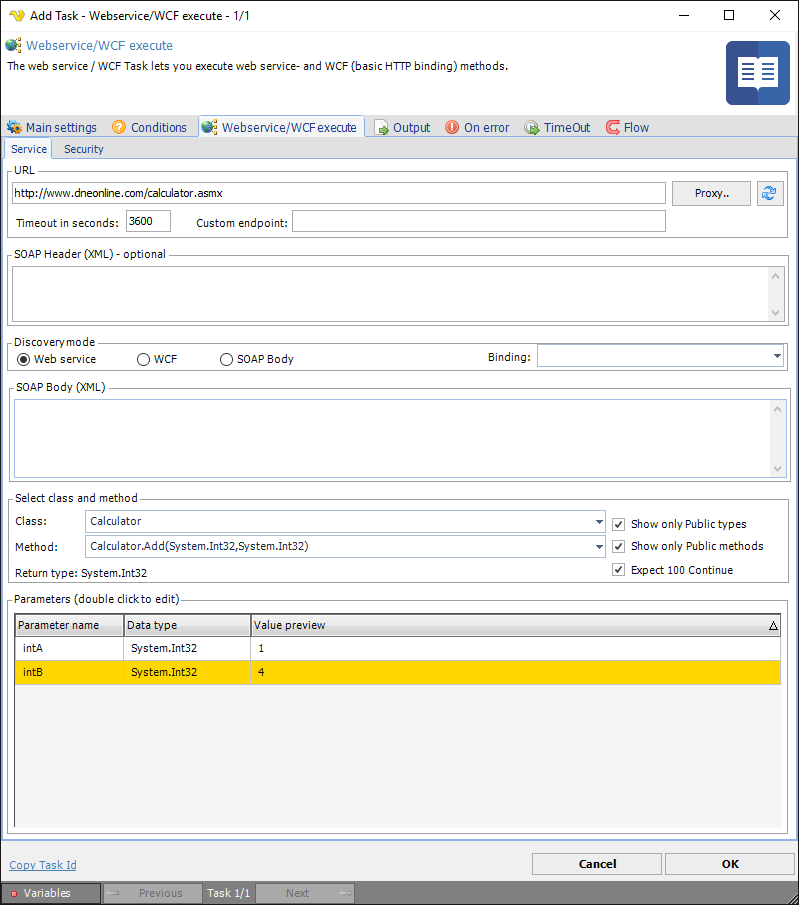
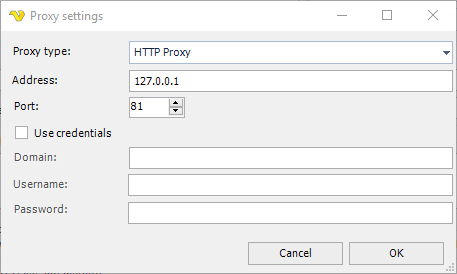
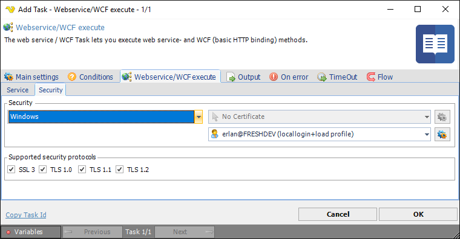

## Task Net - Web Service/WCF Execute

The web service / WCF Task lets you execute web service- and WCF (basic HTTP binding) methods.
 
**Output**

This Task returns a string representation of the original return type (of the method).
 
 
**Service tab**



**URL**

This is the URL that points to the web service. If the method should be executed on a different port you separate original URL with a a colon and then enter the port number like this: [http://mywebsite/mywebservice.asmx:8080](http://mywebsite/mywebservice.asmx:8080)
 
**Proxy**

If you want to execute through a Proxy you click on the "Proxy.." button which will show the proxy settings window.



**Timeout in seconds**

Time until the Task gives up to receive a response. Default one hour, 3600 seconds.
 
**SOAP header (XML) - only available for discovery mode Web- and WCF service**

An optional header to use before the normal XML message. Could be used for some simple authentication
 
**SOAP action (XML) - only available for discovery mode SOAP Body**

If you want a specific SOAP action you specify it here. Otherwise VisualCron will try to auto-generate it.
 
**Discovery mode**

Select if the service is a Web or WCF service or SOAP Body (through web service).
 
**SOAP body (XML) - only available for discovery mode SOAP Body**
Specify the SOAP body you want to send. For example:

```<soapenv:Envelope xmlns:soapenv="http://schemas.xmlsoap.org/soap/envelope/" xmlns:tem="http://tempuri.org/">```

```<soapenv:Header/>```

```<soapenv:Body>```

```<tem:ExportData>```

```<tem:exportName>abc123</tem:exportName>```

```<tem:userName>abc</tem:userName>```

```<tem:password>123</tem:password>```

```</tem:ExportData>```

```</soapenv:Body>```

```</soapenv:Envelope>```

**Binding**

When selecting a WCF service you may select binding after refreshing the classes and methods. The binding tells VisualCron which communication method to use.
 
**Class**

This is the name of the Class.
 
**Show only public types**

When selecting a file or clicking refresh class information is loaded from the assembly. By default, only public classes are loaded. If you want to load class with other modifiers/visibility you must uncheck this.
 
**Method**

When you change the Class all methods within that Class will be populated into the method combo box.
 
**Show only Public methods**

When selecting a file or clicking refresh method information is loaded from the assembly. By default, only public methods are loaded. If you want to load method with other modifiers/visibility you must uncheck this.
 
**Expect 100 Continue**

Enable this if you get HTTP error 417.
 
**Return type**

This label shows the return type of the selected method. This is the type that will be converted to a string in the Output of the Task.
 
**Parameters**

Double click on parameter rows to set values. Depending on the value type different input forms will be used.

.png)

**Security Tab**



**Security - Authentication method**

This Task lets you execute a web service with some different security methods for web authentication:

1. N*one* - no authentication is made
2. *Basic* - Before transmission, the user name is appended with a colon and concatenated with the password. The resulting string is encoded with the Base64 algorithm. For example, given the user name Aladdin and password open sesame, the string Aladdin:open sesame is Base64 encoded, resulting in ```QWxhZGRpbjpvcGVuIHNlc2FtZQ==```. The Base64-encoded string is transmitted and decoded by the receiver, resulting in the colon-separated user name and password string.
3. *Digest* - Digest authentication is intended to supersede unencrypted use of the Basic access authentication, allowing user identity to be established securely without having to send a password in plain text.
4. *Windows* - the current Windows user information on the client computer is supplied by client through a cryptographic exchange involving hashing with the Web server.
5. *Certificate* - this authentication method uses your existing Windows certificates when authenticating
 
**Credential**

This is the Credential that is used in the authentication method. Click on Manage Credentials to create a new Credential.
 
### Troubleshooting:

**The HTTP request is unauthorized with client authentication scheme 'Ntlm'. The authentication header received from the server was 'NTLM'.**

The user name and/or password is wrong.